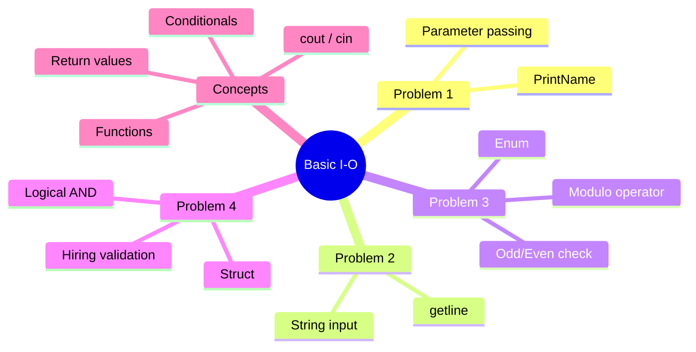

[](https://github.com/aboHuhaed)
[](https://aboHuhaed.github.io)
[](https://linkedin.com/in/ahmed-dawrish)

## Lesson 01-05: Basic I/O in C++

This lesson covers four fundamental programming problems in C++: printing a name, reading user input, checking if a number is odd or even, and validating a hiring condition based on age and driving license status.

**Problem 1** demonstrates a simple function `PrintNameProblem1` that takes a string and prints it. **Problem 2** introduces input with `getline(cin, variable)` to read a full name including spaces. **Problem 3** uses an `enum` to represent number types (Odd/Even) and the modulo operator `%` to determine parity. **Problem 4** introduces `struct` to group related data (age and license status) and uses a logical `&&` operator to enforce that the applicant must be older than 21 AND have a driving license to be hired.

Together, these problems teach function creation, parameter passing, enums, structs, conditionals, and basic I/O operations with `cin` and `cout`.

```cpp
#include <iostream>
#include <string>
using namespace std;
// problem 1

void PrintNameProblem1(string Name)
{
    cout << "\n Your Name is: " << Name << endl;
}

// problem 2

string ReadName ()
{
    string Names;
    cout << "Pleas enter your name? " << endl;
    getline(cin, Names);
    return Names;
}

// problem 3

enum enNumberType { Odd = 1, Even = 2 };

int ReadNumber()
{
    int Num;
    cout << "Pleas Enter a number? " << endl;
    cin >> Num;
    return Num;
}

enNumberType CheckNumberTtype(int Num)
{
    int Result = Num % 2;
    if (Result == 0)
        return enNumberType::Even;
    else
        return enNumberType::Odd;
}

void PrintNumbertType(enNumberType NumberType)
{
    if (NumberType == enNumberType::Even)
        cout << "\n Number Is Even. \n";
    else
        cout << "\n Number Is odd. \n";

}

// problem 4

struct stInfo
{
    int Age;
    bool HasDrivingLicense;
};
stInfo ReadInfo()
{
    stInfo Info;
    cout << "Please Enter YOur Age? " << endl;
    cin >> Info.Age;

    cout << "Do you Have Drvier Lincese?" << endl;
    cin >> Info.HasDrivingLicense;
    return Info;
}

bool IsAcAccepted(stInfo Info)
{
    return (Info.Age > 21 && Info.HasDrivingLicense);
}

void PrintResult(stInfo Info)
{
    if (IsAcAccepted(Info))
        cout << "\n Hired \n";
    else
        cout << "\n Regected \n";

}

int main()
{
    //PrintNameProblem1("Ahmed Darwish");
    //cout << ReadName() << endl;\
    
    // problem3 
    // PrintNumbertType(CheckNumberTtype(ReadNumber()));
     
    // problem 4
    return 0;
}
```

<details>
<summary>Interactive Quiz</summary>

**Q1:** What does the `%` operator do in `CheckNumberTtype`?
- [ ] Divides two numbers
- [x] Returns the remainder of division
- [ ] Multiplies numbers
- [ ] Adds numbers

**Q2:** In Problem 4, what condition must be true for an applicant to be hired?
- [ ] Age > 18 OR has license
- [ ] Age > 21 AND has license
- [x] Age > 21 AND has license
- [ ] Age > 25 AND has license

**Q3:** Which function is used to read a full line including spaces?
- [x] getline(cin, variable)
- [ ] cin >> variable
- [ ] scanf
- [ ] gets

</details>


