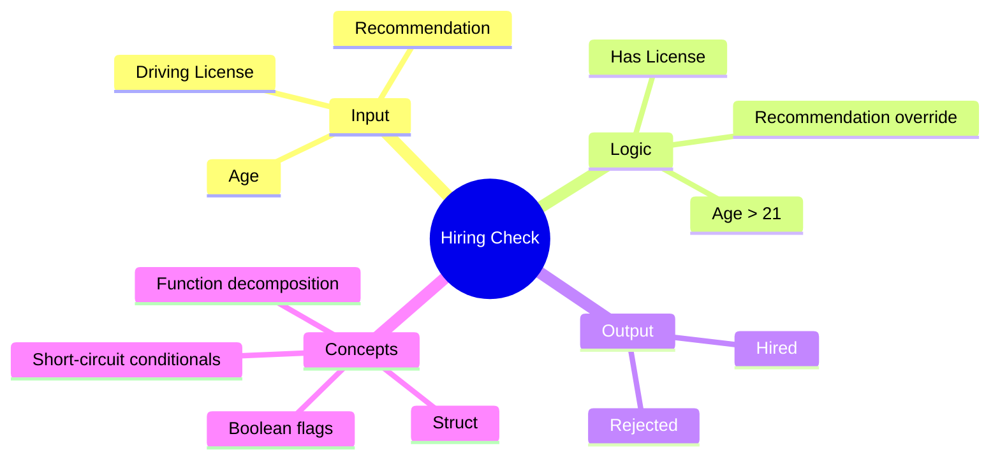

[](https://github.com/aboHuhaed)
[](https://aboHuhaed.github.io)
[](https://linkedin.com/in/ahmed-dawrish)

## Lesson 05: Hiring Check

This program expands on the hiring validation concept by adding a recommendation flag. The `stInfo` struct now holds three fields: `Age`, `HasDrivingLicense`, and `HasRecommendation`. The hiring logic states that if the applicant has a recommendation, they are automatically hired regardless of age or license status. Otherwise, they must be over 21 AND have a driving license.

This demonstrates the concept of short-circuit evaluation with `if-else` logic. The recommendation acts as an override — a common real-world pattern where exceptional circumstances bypass standard requirements. The program reads the user's information, evaluates eligibility via `IsAcAccepted`, and prints "Hired" or "Regected".

```cpp
#include <iostream>
#include <string>
using namespace std;
struct stInfo
{
    int Age;
    bool HasDrivingLicense;
    bool HasRecommendation;
};
stInfo ReadInfo()
{
    stInfo Info;
    cout << "Please Enter YOur Age? " << endl;
    cin >> Info.Age;

    cout << "Do you Have Drvier Lincese?" << endl;
    cin >> Info.HasDrivingLicense;

    cout << "Do you have HasRecommendation?" << endl;
    cin >> Info.HasRecommendation;
    return Info;
}

bool IsAcAccepted(stInfo Info)
{
    if (Info.HasRecommendation)
    {
        return true;
    }
    else
    {
        return (Info.Age > 21 && Info.HasDrivingLicense);

    }
}

void PrintResult(stInfo Info)
{
    if (IsAcAccepted(Info))
        cout << "\n Hired \n";
    else 
        cout << "\n Regected \n";

}

int main()
{
    PrintResult(ReadInfo());

}
```

<details>
<summary>Interactive Quiz</summary>

**Q1:** What happens if `HasRecommendation` is true?
- [x] The applicant is hired immediately
- [ ] The applicant must still be over 21
- [ ] The applicant must still have a license
- [ ] The applicant is rejected

**Q2:** If an applicant is 25, has a license, but no recommendation — are they hired?
- [x] Yes
- [ ] No

**Q3:** What C++ feature is used to group Age, HasDrivingLicense, and HasRecommendation?
- [x] struct
- [ ] class
- [ ] array
- [ ] enum

</details>


