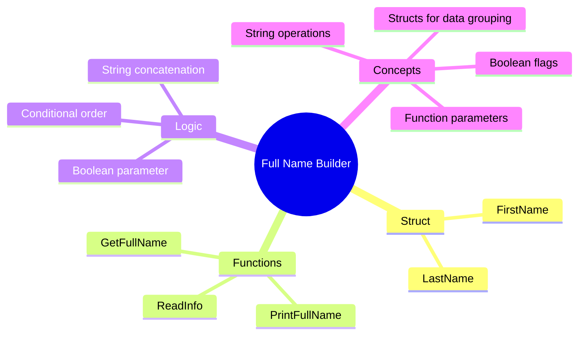

[](https://github.com/aboHuhaed)
[](https://aboHuhaed.github.io)
[](https://linkedin.com/in/ahmed-dawrish)

## Lesson 06-10: Full Name Builder

This program builds a full name from a first name and last name using a `struct` called `stInfo`. The user enters their first and last name via `cin`, and the program can output the full name in normal order (First Last) or reversed order (Last First) based on a boolean parameter.

The key function is `GetFullName`, which accepts a `stInfo` and a `bool reversed` flag. When `reversed` is `true`, the last name appears first. This demonstrates conditional string concatenation and the use of boolean parameters to control function behavior. The `main` function currently calls it with `true`, so it prints the reversed name format.

```cpp
#include <iostream>
#include <string>
using namespace std;
struct stInfo
{
	string FirstName;
	string LastName;
};
stInfo ReadInfo()
{
	stInfo Info;
	cout << "Please Enter Your First Name?" << endl;
	cin >> Info.FirstName;

	cout << "Please Enter Your last Name?" << endl;
	cin >> Info.LastName;

	return Info;
}
string GetFullName(stInfo Info, bool reversed)
{
	string FullName = "";
	if (reversed)
	
		FullName = Info.LastName + " " + Info.FirstName;
	
	else
		FullName = Info.FirstName + " " + Info.LastName;


		return FullName;

}

void PrintFullName(string FullName)
{
	cout << "\n Your Full Name is : " << FullName << endl;
}
int main()
{
	PrintFullName(GetFullName(ReadInfo(), true));
}
```

<details>
<summary>Interactive Quiz</summary>

**Q1:** What does `GetFullName` return when `reversed` is `false`?
- [x] FirstName + " " + LastName
- [ ] LastName + " " + FirstName
- [ ] Only FirstName
- [ ] Only LastName

**Q2:** What is the purpose of the boolean parameter in this program?
- [ ] To check if the user exists
- [x] To control the name order (normal vs reversed)
- [ ] To validate input
- [ ] To print the name twice

**Q3:** If the user enters "John" and "Doe" with `reversed = true`, what prints?
- [ ] John Doe
- [x] Doe John
- [ ] John
- [ ] Doe

</details>


