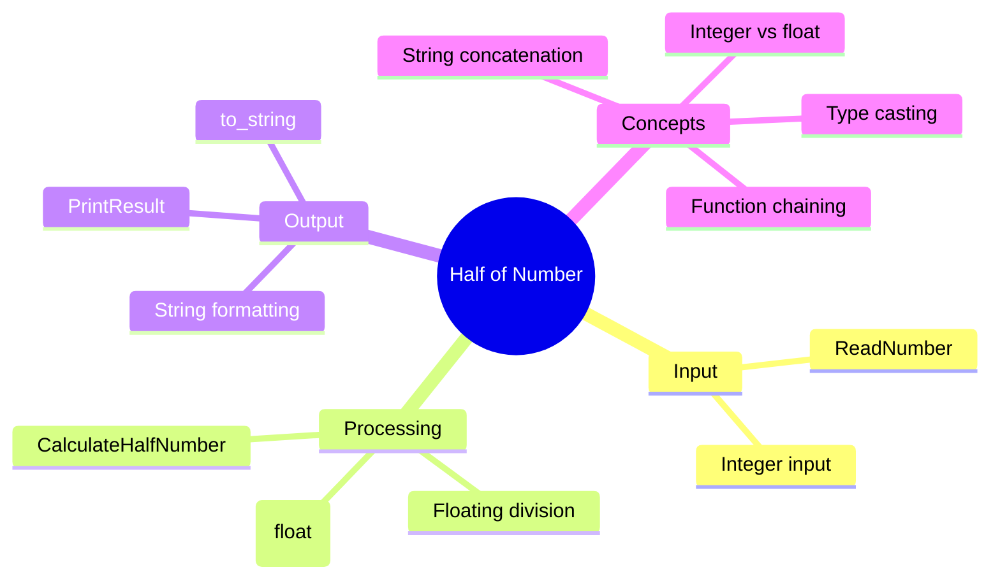

[](https://github.com/aboHuhaed)
[](https://aboHuhaed.github.io)
[](https://linkedin.com/in/ahmed-dawrish)

## Lesson 07: Half of Number

This program reads an integer from the user, computes its half using floating-point division, and prints a formatted result string. The `ReadNumber` function gets the input, `CalculateHalfNumber` performs the division with an explicit cast to `float` to preserve the decimal part, and `PrintResult` constructs a descriptive output using `to_string`.

The explicit cast `(float)Num / 2` is crucial — without it, integer division would truncate the result. For example, `5 / 2` as integers yields `2`, but `(float)5 / 2` yields `2.5`. This teaches type casting and the difference between integer and floating-point arithmetic.

```cpp
#include <iostream>
#include <string>
using namespace std;
int ReadNumber()
{
	int Num;
	cout << "Please Enter A Number? " << endl;
	cin >> Num;
	return Num;
}
float CalculateHalfNumber(int Num)
{
	return (float)Num / 2;
}

void PrintResult(int Num)
{
	string Result = "Half of " + to_string(Num) + " is " + to_string(CalculateHalfNumber(Num));
	cout << endl << Result << endl;
}
int main()
{	
	PrintResult(ReadNumber());
	return 0;

}
```

<details>
<summary>Interactive Quiz</summary>

**Q1:** Why is `(float)` used in `CalculateHalfNumber`?
- [ ] To convert the result to an integer
- [x] To preserve the decimal part during division
- [ ] To double the number
- [ ] To print the number

**Q2:** What would `CalculateHalfNumber(7)` return without the cast?
- [ ] 3.5
- [x] 3
- [ ] 3.0
- [ ] 4

**Q3:** What does `to_string` do in `PrintResult`?
- [x] Converts a number to a string
- [ ] Converts a string to a number
- [ ] Prints the number
- [ ] Reads the number

</details>


