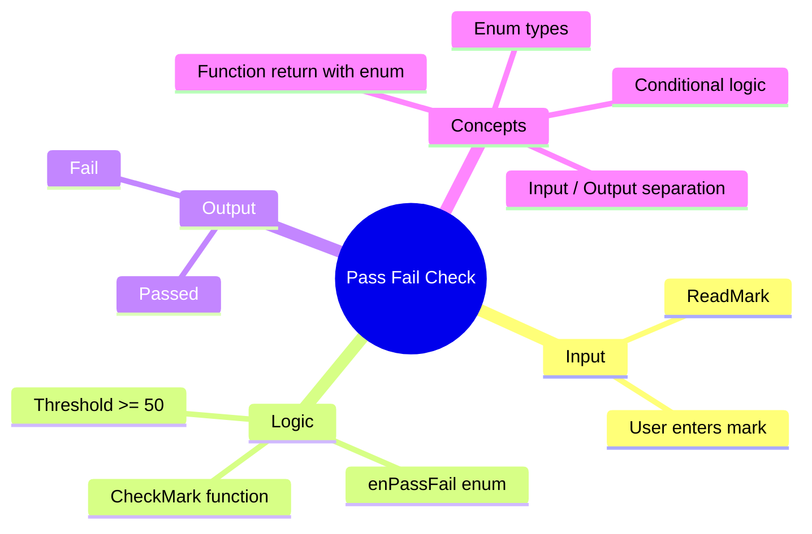

[](https://github.com/aboHuhaed)
[](https://aboHuhaed.github.io)
[](https://linkedin.com/in/ahmed-dawrish)

## Lesson 08: Pass Fail Check

This program reads a student's mark and determines whether they passed or failed using an `enum`. The threshold is 50 — marks 50 and above are passing, below 50 is failing.

The `enum enPassFail` provides two named constants (`Pass` and `Fail`) that make the code more readable than raw integers or booleans. The `CheckMark` function returns the appropriate enum value, and `PrintResults` uses it in a conditional to display the result. This pattern — returning a named type from a validation function — improves code clarity and maintainability.

```cpp
#include <iostream>
using namespace std;
enum enPassFail { Pass = 1, Fail = 2 };

int ReadMark()
{
	int mark;
	cout << "Please enter mark ?" << endl;
	cin >> mark;
	return mark;
}

enPassFail CheckMark(int mark)
{
	if (mark >= 50)
		return enPassFail::Pass;
	else 
		return enPassFail::Fail;

}
void PrintResults(int mark)
{
	if (CheckMark(mark) == enPassFail::Pass)
		cout << "\n You Passed" << endl;
	else 
		cout << "\n You Fail" << endl;

}

int main()
{
	 PrintResults(ReadMark());

}
```

<details>
<summary>Interactive Quiz</summary>

**Q1:** What mark is needed to pass?
- [ ] > 50
- [x] >= 50
- [ ] > 60
- [ ] >= 40

**Q2:** What does the `enum` keyword do in this program?
- [ ] Creates a struct
- [x] Defines a set of named constants
- [ ] Declares a variable
- [ ] Prints output

**Q3:** If a student scores 49, what is the output?
- [ ] You Passed
- [x] You Fail
- [ ] Invalid
- [ ] No output

</details>


