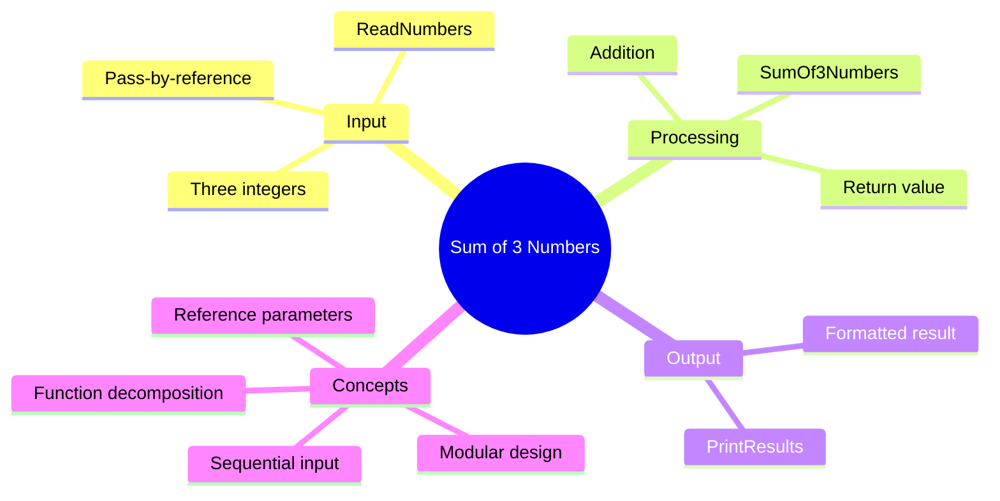

[](https://github.com/aboHuhaed)
[](https://aboHuhaed.github.io)
[](https://linkedin.com/in/ahmed-dawrish)

## Lesson 09: Sum of 3 Numbers

This program reads three integers from the user using pass-by-reference, calculates their sum, and prints the result. The `ReadNumbers` function uses reference parameters (`int& Num1, int& Num2, int& Num3`) so the values read inside the function are directly stored in the variables declared in `main`. This avoids returning multiple values.

`SumOf3Numbers` takes the three numbers by value and returns their sum. `PrintResults` displays the total. The separation of input, processing, and output into distinct functions follows good modular programming practices.

```cpp
// Problem 9.cpp : This file contains the 'main' function. Program execution begins and ends there.
//

#include <iostream>
using namespace std;

void ReadNumbers(int& Num1, int& Num2, int& Num3)
{
    cout << "Please enter your Number 1 ? " << endl;
    cin >> Num1;

    // Prompt the user to enter the second number and store it in Num2.
    cout << "Please enter your Number 2 ? " << endl;
    cin >> Num2;

    // Prompt the user to enter the third number and store it in Num3.
    cout << "Please enter your Number 3 ? " << endl;
    cin >> Num3;
}
int SumOf3Numbers(int Num1, int Num2, int Num3)
{
    return Num1 + Num2 + Num3;  // Compute and return the sum.
}
void PrintResults(int Total)
{
    // Print the calculated sum of the numbers.
    cout << "\n The total sum of numbers is: " << Total << endl;
}

int main()
{
    int Num1,Num2, Num3;
    ReadNumbers(Num1, Num2, Num3);
    PrintResults(SumOf3Numbers(Num1, Num2, Num3));
}
```

<details>
<summary>Interactive Quiz</summary>

**Q1:** What does the `&` symbol in `int& Num1` mean?
- [ ] It takes the address of Num1
- [x] It passes Num1 by reference
- [ ] It creates a pointer
- [ ] It multiplies Num1

**Q2:** How many functions are called in `main`?
- [ ] 1
- [x] 2
- [ ] 3
- [ ] 4

**Q3:** If the user enters 5, 10, and 15, what is the output?
- [ ] 25
- [x] 30
- [ ] 20
- [ ] 15

</details>


