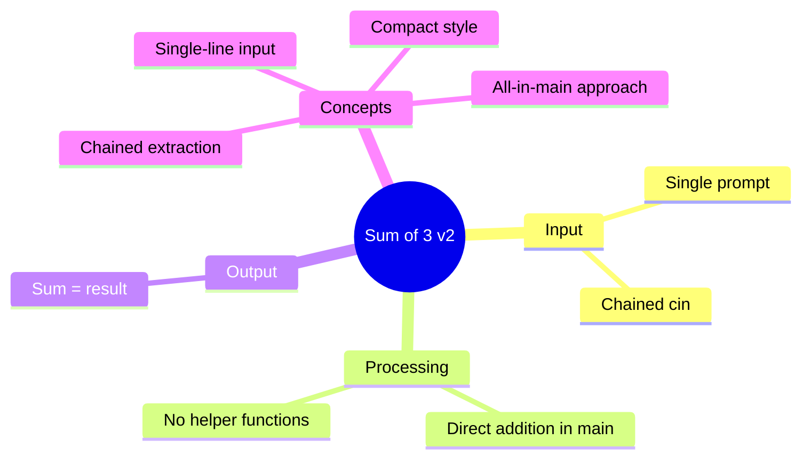

[](https://github.com/aboHuhaed)
[](https://aboHuhaed.github.io)
[](https://linkedin.com/in/ahmed-dawrish)

## Lesson 10: Sum of 3 v2

This is a more concise version of the sum-of-three-numbers program. Instead of using separate functions for each step, all logic is written directly inside `main`. The user is prompted once with a single message to enter three numbers, which are read in one line using chained `cin` (`cin >> num1 >> num2 >> num3`).

This approach demonstrates that you can read multiple values with a single input statement. The sum is calculated and printed immediately. While less modular than Lesson 09, this version is more compact and suitable for simple scripts.

```cpp
#include <iostream>
using namespace std;
int main() {
    int num1, num2, num3;
    cout << "Enter 3 numbers: ";
    cin >> num1 >> num2 >> num3;
    int sum = num1 + num2 + num3;
    cout << "Sum = " << sum << endl;
    return 0;
}
```

<details>
<summary>Interactive Quiz</summary>

**Q1:** How are the three numbers read from the user?
- [ ] Three separate cin statements
- [x] One cin with chained extraction
- [ ] Using getline
- [ ] Using scanf

**Q2:** What is the output for input "2 4 6"?
- [ ] 10
- [ ] 11
- [x] 12
- [ ] 14

**Q3:** How does this version differ from Lesson 09?
- [ ] It uses more functions
- [x] All logic is in main
- [ ] It uses classes
- [ ] It reads strings

</details>


