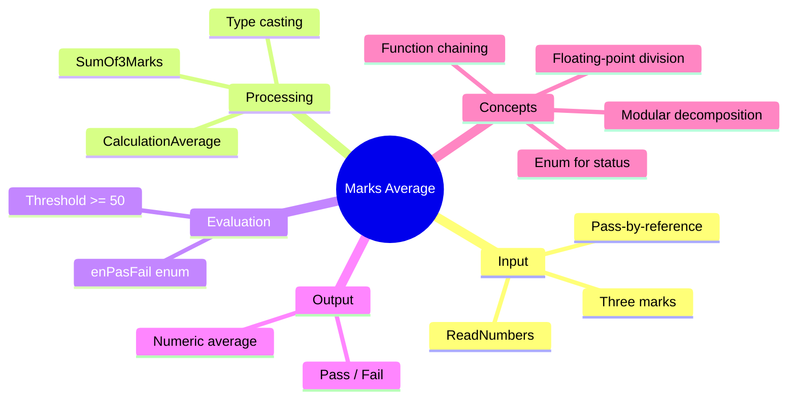

[](https://github.com/aboHuhaed)
[](https://aboHuhaed.github.io)
[](https://linkedin.com/in/ahmed-dawrish)

## Lesson 11.1: Marks Average

This program reads three exam marks from the user, calculates their average, and determines whether the student passed or failed. It combines concepts from previous lessons — input via reference parameters, an `enum` for pass/fail, a summation function, and an average calculation with type casting.

The `SumOf3Marks` function adds the three marks, and `CalculationAverage` divides the sum by 3.0 using a `(float)` cast to ensure decimal precision. `CheckAverage` compares the average against 50 (the passing threshold) using the `enPasFail` enum. The result is printed with both the numeric average and the pass/fail status.

```cpp
#include <iostream>
#include <string>
using namespace std;
enum enPasFail { Pass = 1, Fail = 2 };
void ReadNumbers(int& Mark1, int& Mark2, int& Mark3)
{
	cout << "************************\n";
	cout << "Please enter Mark 1? " << endl;
	cin >> Mark1;
	
	cout << "Please enter Mark 2? " << endl;
	cin >> Mark2;
	
	cout << "Please enter Mark 3? " << endl;
	cin >> Mark3;
}
int SumOf3Marks(int Mark1, int Mark2, int Mark3)
{
	return Mark1 + Mark2 + Mark3;
}

float CalculationAverage(int Mark1, int Mark2, int Mark3)
{
	return (float)SumOf3Marks(Mark1, Mark2, Mark3) / 3;
}
enPasFail CheckAverage(float Average)
{
	if (Average >= 50)
		return enPasFail::Pass;
	else 
		return enPasFail::Fail;

}

void PrintResults(float Average)
{
	cout << "\n Your Average is : " << Average << endl;
	if (CheckAverage(Average) == enPasFail::Pass)
		cout << "\n Your Passed" << endl;
	else 
		cout << "\n Your Faild" << endl;

}
int main()
{
	int Mark1, Mark2, Mark3;
	ReadNumbers(Mark1, Mark2, Mark3);
	PrintResults(CalculationAverage(Mark1, Mark2, Mark3));

	return 0;
}
```

<details>
<summary>Interactive Quiz</summary>

**Q1:** What is the passing threshold for the average?
- [ ] 40
- [x] 50
- [ ] 60
- [ ] 70

**Q2:** Why is `(float)` used in `CalculationAverage`?
- [ ] To round the average
- [x] To preserve decimal precision
- [ ] To convert to integer
- [ ] To increase the sum

**Q3:** If the marks are 40, 50, and 60, what is the average?
- [x] 50
- [ ] 150
- [ ] 45
- [ ] 55

</details>


