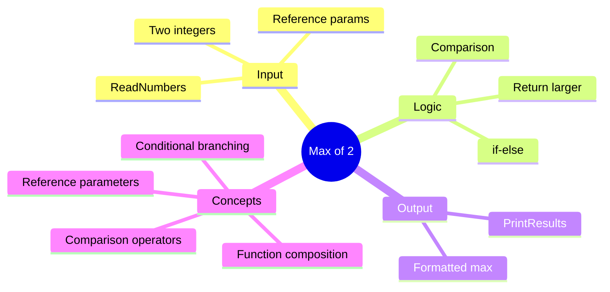

[](https://github.com/aboHuhaed)
[](https://aboHuhaed.github.io)
[](https://linkedin.com/in/ahmed-dawrish)

## Lesson 12: Max of 2

This program reads two integers and prints the larger one. `ReadNumbers` uses pass-by-reference to get both values from the user. `MaxOf2Numbers` compares the two numbers with a simple `if-else` statement and returns the greater value.

This teaches basic comparison logic and conditional branching. The pattern of reading input in one function, processing in another, and printing in a third follows the separation of concerns principle, making each function focused on a single responsibility.

```cpp
#include <iostream>
#include <string>
using namespace std;

void ReadNumbers(int& Num1, int& Num2)
{
	cout << "**************************\n";
	cout << "Please int Your Number one? \n";
	cin >> Num1;
	cout << "Please int Your Number two? \n";
	cin >> Num2;
	cout << "**************************\n";

}

int MaxOf2Numbers(int Num1, int Num2)
{
	if (Num1 > Num2)
		return Num1;
	else
		return Num2;
}

void PrintResults(int Max)
{
	cout << "The Max Number: " << Max << endl;

}
int main()
{
	int Num1,  Num2;
	ReadNumbers(Num1, Num2);
	PrintResults(MaxOf2Numbers(Num1, Num2));
}
```

<details>
<summary>Interactive Quiz</summary>

**Q1:** If Num1 = 10 and Num2 = 20, what is returned by `MaxOf2Numbers`?
- [ ] 10
- [x] 20
- [ ] 30
- [ ] 0

**Q2:** What happens if both numbers are equal?
- [ ] It returns the first number
- [x] It returns the second number (via else)
- [ ] It returns 0
- [ ] It crashes

**Q3:** How are the two numbers passed to `ReadNumbers`?
- [ ] By value
- [x] By reference
- [ ] By pointer
- [ ] As global variables

</details>


