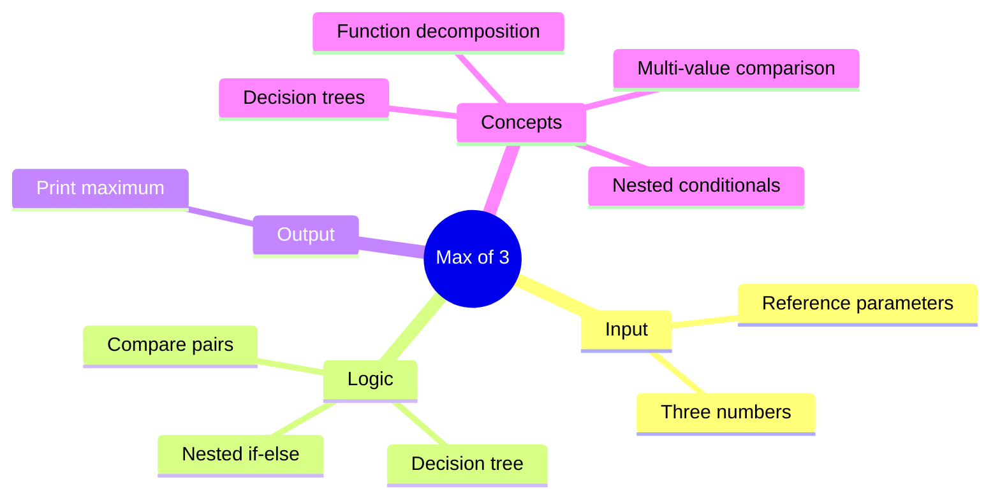

[](https://github.com/aboHuhaed)
[](https://aboHuhaed.github.io)
[](https://linkedin.com/in/ahmed-dawrish)

## Lesson 13: Max of 3

This program finds the maximum of three integers using nested `if-else` statements. `MaxOf3Numbers` first compares Num1 with Num2. If Num1 is greater, it then compares Num1 with Num3 to decide the overall maximum. If Num2 is greater, it compares Num2 with Num3.

This nested conditional structure demonstrates how to extend simple two-value comparison logic to handle three values. The decision tree ensures every possible ordering of the three numbers is covered. The program follows the same modular pattern: input, process, output.

```cpp
#include <iostream>
#include <string>
using namespace std;

void ReadNumbers(int& Num1, int& Num2 , int & Num3)
{
	cout << "**************************\n";
	cout << "Please int Your Number one? \n";
	cin >> Num1;
	cout << "Please int Your Number two? \n";
	cin >> Num2;
	cout << "Please int Your Number three? \n";
	cin >> Num3;
	cout << "**************************\n";

}

int MaxOf3Numbers(int Num1, int Num2 ,int Num3)
{
	if (Num1 > Num2) {
		if (Num1 > Num3)
		{
			return Num1;

		}
		else {
			return Num3;
		}
	}
	else
	{
		if (Num2 > Num3)
		{
			return Num2;
		}
		else
		{
			return Num3;
		}
	}
		

		
}

void PrintResults(int Max)
{
	cout << "The Max Number: " << Max << endl;

}
int main()
{
	int Num1,  Num2 , Num3;
	ReadNumbers(Num1, Num2 , Num3);
	PrintResults(MaxOf3Numbers(Num1, Num2 , Num3));
}
```

<details>
<summary>Interactive Quiz</summary>

**Q1:** If Num1=5, Num2=9, Num3=3, what does `MaxOf3Numbers` return?
- [ ] 5
- [x] 9
- [ ] 3
- [ ] 8

**Q2:** How many levels of nesting are in `MaxOf3Numbers`?
- [ ] 1
- [x] 2
- [ ] 3
- [ ] 4

**Q3:** What is the maximum of 7, 7, and 3?
- [ ] 3
- [x] 7
- [ ] 10
- [ ] 17

</details>


