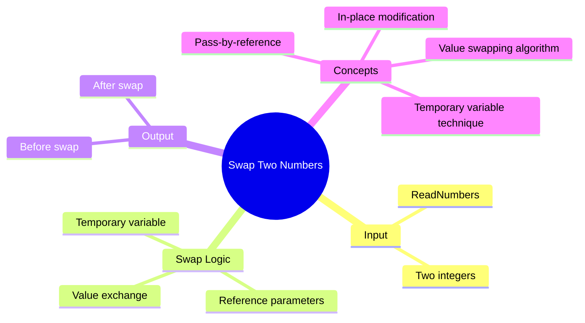

[](https://github.com/aboHuhaed)
[](https://aboHuhaed.github.io)
[](https://linkedin.com/in/ahmed-dawrish)

## Lesson 14: Swap Two Numbers

This program swaps the values of two integers using a temporary variable. The `Swap` function takes both numbers by reference, stores the first value in a temporary variable `team`, assigns the second value to the first, and then assigns the temporary value to the second.

The program prints the numbers before and after swapping so the user can verify the exchange. The use of reference parameters is essential here — without `&`, the swap would only affect local copies inside the function and the original variables in `main` would remain unchanged.

```cpp
#include <iostream>
#include <string>
using namespace std;
void ReadNumbers(int &Num1, int &Num2)
{
	cout << "Please enter number 1 \n";
	cin >> Num1;
	cout << "Please enter number 2 \n";
	cin >> Num2;

}
void Swap(int &a , int&b)
{ 
	int team;
	team = a; 
	a = b;
	b = team;
}
void PrintNumbers(int Num1, int Num2)
{
	cout << "The Number 1 = " << Num1 << endl;
	cout << "The Number 2 = " << Num2 << endl;
}
int main()
{
	int Num1, Num2;
	ReadNumbers(Num1, Num2);
	PrintNumbers(Num1, Num2);
	Swap(Num1, Num2);
	PrintNumbers(Num1, Num2);
	return 0;
}
```

<details>
<summary>Interactive Quiz</summary>

**Q1:** Why must `Swap` use reference parameters?
- [ ] To avoid memory usage
- [x] To modify the original variables
- [ ] To make the code faster
- [ ] To prevent errors

**Q2:** If Num1=5 and Num2=10 before swap, what are they after?
- [ ] 5 and 10
- [x] 10 and 5
- [ ] 5 and 5
- [ ] 10 and 10

**Q3:** What is the purpose of the `team` variable?
- [ ] To print the result
- [x] To temporarily hold one value
- [ ] To add the numbers
- [ ] To count iterations

</details>


