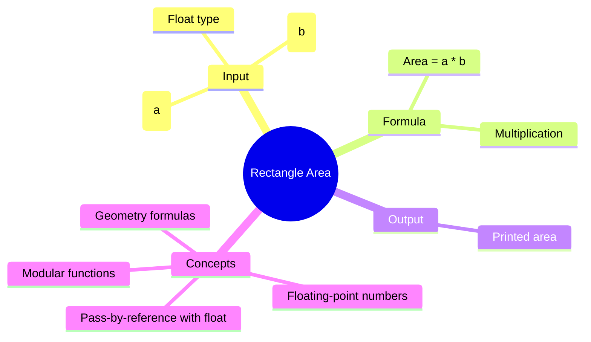

[](https://github.com/aboHuhaed)
[](https://aboHuhaed.github.io)
[](https://linkedin.com/in/ahmed-dawrish)

## Lesson 15: Rectangle Area

This program calculates the area of a rectangle given its width and height. The formula is simple: `Area = a * b`. The program reads two floating-point numbers (side `a` and side `b`) using pass-by-reference, computes the area, and prints the result.

This introduces the `<cmath>` library (included but not used here — it becomes relevant in later geometry lessons) and demonstrates working with `float` types for decimal precision. The modular structure keeps reading, calculating, and printing in separate functions.

```cpp
#include <iostream>
#include <cmath>

using namespace std;
void ReadNubmers(float& a, float& b)
{
	cout << "Pleas enter num 1" << endl;
	cin >> a;
	cout << "Please enter num 2" << endl; 
	cin >> b;
}
float CalculateRectangleArea(float a, float b)
{
	return a * b;
}
void PrintResults(float ARea)
{
	cout << "The Area is : " << ARea << endl;
}
int main()
{
	float a, b;
	ReadNubmers(a, b);
	PrintResults(CalculateRectangleArea(a, b));
	return 0;
}
```

<details>
<summary>Interactive Quiz</summary>

**Q1:** What is the formula for rectangle area?
- [ ] a + b
- [x] a * b
- [ ] 2 * (a + b)
- [ ] a / b

**Q2:** If a = 5.5 and b = 2.0, what is the area?
- [ ] 7.5
- [x] 11.0
- [ ] 10.0
- [ ] 15.0

**Q3:** Why are the parameters `float` instead of `int`?
- [x] To allow decimal values
- [ ] To save memory
- [ ] To improve speed
- [ ] To avoid errors

</details>


