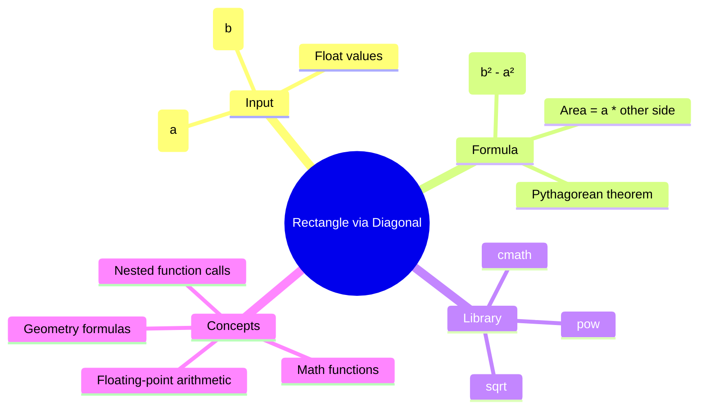

[](https://github.com/aboHuhaed)
[](https://aboHuhaed.github.io)
[](https://linkedin.com/in/ahmed-dawrish)

## Lesson 16: Rectangle Area via Diagonal

This program calculates the area of a rectangle using one side and the diagonal. The formula uses the Pythagorean theorem: if `a` is one side and `b` is the diagonal, then the other side is `sqrt(b² - a²)`, and the area is `a * sqrt(b² - a²)`.

The `<cmath>` library provides `sqrt` (square root) and `pow` (power) functions. `pow(b, 2)` computes `b²`. This problem demonstrates how mathematical formulas from geometry can be translated directly into C++ code using the standard math library.

```cpp
#include <iostream>
#include <cmath>

using namespace std;
void ReadNubmers(float& a, float& b)
{
	cout << "Pleas enter num 1" << endl;
	cin >> a;
	cout << "Please enter num 2" << endl;
	cin >> b;
}
float CalculateRectangleArea(float a, float b)
{
	float Area=  a * sqrt(pow(b,2) - pow(a,2));
	return Area;
}
void PrintResults(float ARea)
{
	cout << "The Area is : " << ARea << endl;
}
int main()
{
	float a, b;
	ReadNubmers(a, b);
	PrintResults(CalculateRectangleArea(a, b));
	return 0;
}
```

<details>
<summary>Interactive Quiz</summary>

**Q1:** What library provides `sqrt` and `pow`?
- [ ] <iostream>
- [x] <cmath>
- [ ] <string>
- [ ] <math>

**Q2:** If a = 3 and b = 5 (diagonal), what is the area?
- [ ] 15
- [ ] 10
- [x] 12
- [ ] 8

**Q3:** What mathematical theorem is used here?
- [ ] Binomial theorem
- [x] Pythagorean theorem
- [ ] Euclid's theorem
- [ ] Bayes' theorem

</details>


