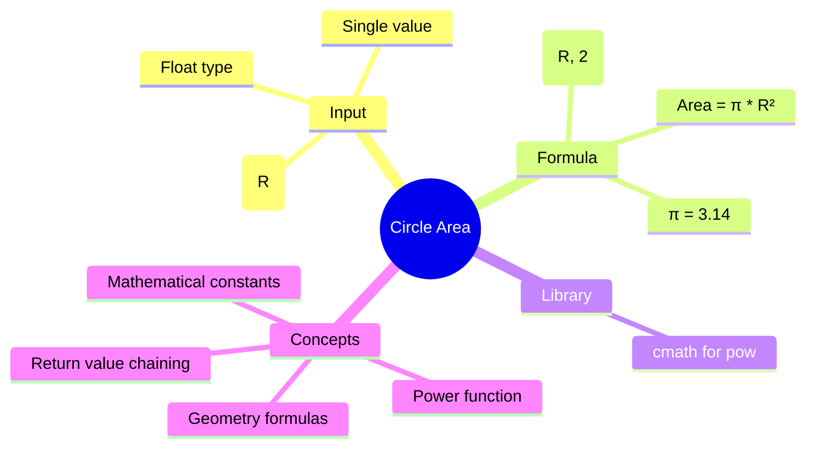

[](https://github.com/aboHuhaed)
[](https://aboHuhaed.github.io)
[](https://linkedin.com/in/ahmed-dawrish)

## Lesson 18: Circle Area

This program calculates the area of a circle given its radius. The formula is `Area = π * r²`, where π is approximated as 3.14. The program reads the radius `R` as a float, computes `pow(R, 2)` for the square, multiplies by π, and prints the result.

This is the first program that introduces a mathematical constant (π) defined as a local variable. Using `pow(R, 2)` from `<cmath>` demonstrates how to compute powers without manual multiplication. The constant `pi = 3.14` is a simple approximation; in production code, a more precise value like `M_PI` from `<cmath>` would be used.

```cpp
// Write a program to calculate circle area then print it on the screen.
#include <iostream>
#include <cmath>
#include <string>
using namespace std;
float ReadNumber()
{
	float R;
	cout << "Pleas Enter Area" << endl;
	cin >> R;
	return R;

}
float CircleArea(float R)
{
	float pi = 3.14;
	float Area = pow(R,2) * pi;
	return Area;
}
void PrintResults(float Area)
{
	cout << "The Area is : " << Area << endl;
}
int main()
{	
	PrintResults(CircleArea(ReadNumber()));
	return 0;
}
```

<details>
<summary>Interactive Quiz</summary>

**Q1:** What is the approximate value of π used in this program?
- [ ] 3.14159
- [x] 3.14
- [ ] 3.1
- [ ] 3.142

**Q2:** If radius = 7, what is the area (using π = 3.14)?
- [ ] 153.86
- [x] 153.86
- [ ] 154
- [ ] 150

**Q3:** What does `pow(R, 2)` compute?
- [ ] √R
- [x] R²
- [ ] 2ᴿ
- [ ] R × 2

</details>


