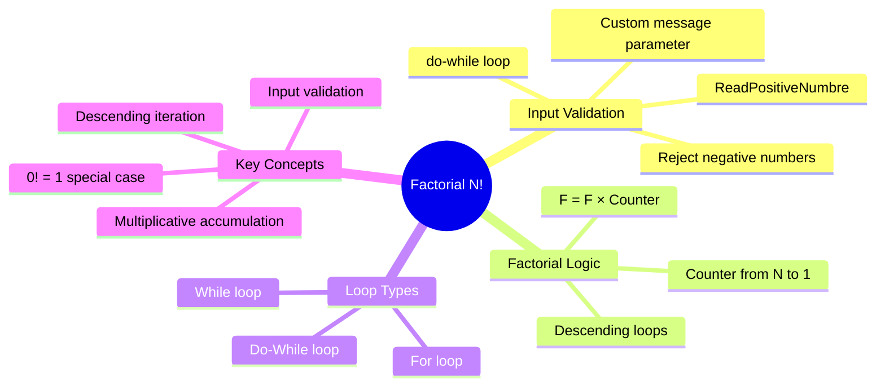

[](https://github.com/aboHuhaed)
[](https://aboHuhaed.github.io)
[](https://linkedin.com/in/ahmed-dawrish)

## Factorial of N (N!)

This program calculates the factorial of a positive integer N, written as N!. Factorial is the product of all positive integers from 1 to N (or N down to 1). The program demonstrates input validation (rejecting negative numbers with a `do-while` loop) and implements factorial using all three loop types with descending iteration.

```cpp
/*// 
Problem :
Write a program to calculate factorial of N!
Example : factorial of 6
6 x 5 x 4 x 3 x 2 x 1 = 720
Note : User should only enter positive number, other wise reject it and ask to enter again*/
#include <iostream>
#include <string>
using namespace std;


int ReadPositiveNumbre(string Message)
{
	int Number;
	do
	{
		cout << Message << endl;
		cin >> Number;
	} while (Number < 0);
	return Number;
}

int FactorialFor(int N)
{
	int F = 1;
	for (int Counter = N; Counter >= 1; Counter--)
	{
		F = F * Counter;
	}
	return F;
}
int FactorialWhile(int N)
{
	int F = 1;
	int Counter = N;
	while( Counter >= 1 )
	{
		F = F * Counter;
		Counter--;
	}
	return F;
}

int FactorialDoWhile(int N)
{
	int F = 1;
	int Counter = N;
	do
	{
		F = F * Counter;
		Counter--;
	}while (Counter >= 1);
	return F;
}


int main()
{
	cout << FactorialFor(ReadPositiveNumbre("Enter Number? ")) << endl;
	cout << FactorialWhile(ReadPositiveNumbre("Enter Number? ")) << endl;
	cout << FactorialDoWhile(ReadPositiveNumbre("Enter Number? ")) << endl;

}
```

### How It Works

`ReadPositiveNumbre` uses a `do-while` loop to repeatedly ask for input until a non-negative number is entered (the condition `Number < 0` keeps looping). Each factorial function multiplies numbers from N down to 1 using `F = F * Counter`. The accumulator `F` starts at 1 (since 1 is the multiplicative identity). Descending order matches the mathematical definition: 6! = 6 × 5 × 4 × 3 × 2 × 1. The program demonstrates all three loop types for the same task.

### Concepts Introduced

| Concept | Explanation |
|---|---|
| **Factorial definition** | N! = N × (N-1) × (N-2) × ... × 1 |
| **Input validation** | Rejecting negative numbers with a `do-while` loop |
| **Multiplicative accumulation** | `F = F * Counter` — building a product across iterations |
| **Descending loops** | Counting down from N to 1 using `Counter--` |
| **Function with message parameter** | Passing a custom prompt string to `ReadPositiveNumbre` |

### Quiz

<details>
<summary>1. What is 5! (5 factorial)?</summary>

5 × 4 × 3 × 2 × 1 = 120.
</details>

<details>
<summary>2. Why is the accumulator variable <code>F</code> initialized to 1 instead of 0?</summary>

Because 0 multiplied by anything is 0. Starting at 1 (the multiplicative identity) ensures the product is correct.
</details>

<details>
<summary>3. What happens if the user enters -3?</summary>

The `do-while` loop in `ReadPositiveNumbre` repeats because `-3 < 0` is true. It keeps asking until a non-negative number is entered.
</details>

<details>
<summary>4. What is 0! (zero factorial)?</summary>

0! is defined as 1. In the `for` loop, since `Counter = 0` and `0 >= 1` is false, the loop never executes and `F` stays 1.
</details>

### Concept Map


