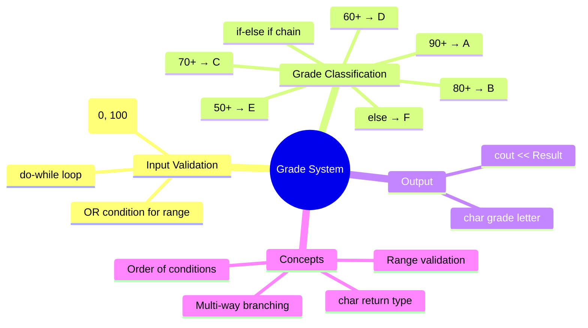

[](https://github.com/aboHuhaed)
[](https://aboHuhaed.github.io)
[](https://linkedin.com/in/ahmed-dawrish)

## Grade System (Letter Grades)

This program converts a numeric grade (0-100) into a letter grade (A through F) using an if-else if chain. It also includes input validation using a `do-while` loop to ensure the grade falls within the valid range before processing. This is a classic example of multi-way branching and score classification.

```cpp
/*Write a program to ask the user to enter :
•
Grade
Then print the grade as follows :
•
90 – 100 Print A
•
80 –89 Print B
•
70 –79 Print C
•
60 –69 Print D
•
50 –59 Print E
•
Otherwise Print F*/
#include <iostream>
#include <string>

using namespace std;

int ReadNumberRange(int From, int To)
{
	int Grade;
	do
	{
		cout << "Please enter a Grade between 0 and 100?\n";
		cin >> Grade;

	} while (Grade < From || Grade > To);
	return Grade;
}

char GetGradeLetter(int Grade)
{
	if (Grade >= 90)
		return 'A';
	else if (Grade >= 80)
		return 'B';
	else if (Grade >= 70)
		return 'C'; 
	else if (Grade >= 60)
		return 'D';
	else if (Grade >= 50)
		return 'E';
	else
		return 'F';
}

int main()
{
	int Grade = ReadNumberRange(0, 100);
	cout << "Result = " <<GetGradeLetter(Grade);
	return 0;
}
```

### How It Works

`ReadNumberRange` uses a `do-while` loop with the condition `Grade < From || Grade > To` (OR logic) to keep asking until a valid grade is entered. The `GetGradeLetter` function uses an `if-else if` chain — it checks from highest to lowest (90+, 80+, etc.). Because the conditions are evaluated in order, once a condition is true, the rest are skipped. This means `Grade >= 80` is only reached if the grade is below 90, automatically placing it in the 80-89 range. Any grade below 50 falls through to the final `else` and gets an 'F'.

### Concepts Introduced

| Concept | Explanation |
|---|---|
| **if-else if chain** | Sequential conditional checks from highest to lowest |
| **Range validation** | Ensuring input is within [0, 100] using `||` (OR) |
| **Multi-way branching** | Multiple possible paths based on different conditions |
| **Order matters** | Checking higher ranges first to avoid overlap issues |
| **char return type** | Returning a single character (A-F) instead of a string |

### Quiz

<details>
<summary>1. Why does the function check <code>Grade >= 90</code> before <code>Grade >= 80</code>?</summary>

Because if it checked 80 first, a grade of 95 would match 80 and return B. Checking higher thresholds first ensures correct classification.
</details>

<details>
<summary>2. What grade does a score of 75 receive?</summary>

75 is ≥ 70 but < 80, so it falls through 90 and 80 checks and returns 'C'.
</details>

<details>
<summary>3. What does the <code>do-while</code> condition <code>Grade From || Grade > To</code> do?</summary>

It continues looping as long as the grade is less than 0 OR greater than 100 — meaning the input is invalid.
</details>

<details>
<summary>4. What would happen if the <code>else</code> block was missing?</summary>

If grade < 50, none of the `if` conditions would match. The function would have undefined behavior because not all paths return a value.
</details>

### Concept Map


