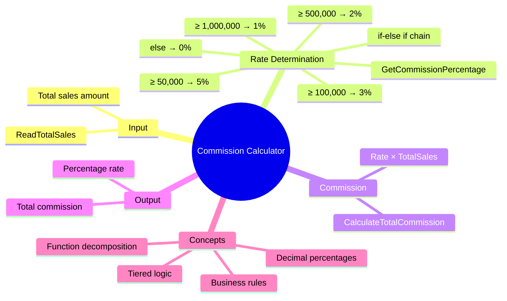

[](https://github.com/aboHuhaed)
[](https://aboHuhaed.github.io)
[](https://linkedin.com/in/ahmed-dawrish)

## Commission Calculator

This program calculates a sales commission based on total sales amount using tiered percentage rates. It introduces the concept of tiered/bracketed logic where different ranges trigger different percentages. The commission rate varies from 0% to 5% depending on the sales bracket, demonstrating real-world business logic implementation.

```cpp
/* Write a program to ask the user to enter :
•
TotalSales
The commission is calculated as one percentage * the total sales amount, all you need is to decide which percentage
to use of the following :
•
> 1000, 000

Percentage is 1 %
•
> 500K to 1M

Percentage is 2 %
•
> 100K –500K

Percentage is 3 %
•
> 50K to 100K

Percentage is 5 %
•
Otherwise

Percentage is 0 % */
#include <iostream>
#include <string>

using namespace std;

int ReadTotalSales()
{
	int Sales;
	cout << "Please Enter Total Sales \n";
	cin >> Sales;
	return Sales;
}

float GetCommissionPercentage(float TotalSales)
{
	if (TotalSales >= 1000000)
		return 0.01;
	else if (TotalSales >= 500000)
		return 0.02;
	else if (TotalSales >= 100000)
		return 0.03;
	else if (TotalSales >= 50000)
		return 0.05;
	else
		return 0.00;
}

float CalculateTotalCommission(float TotalSales)
{
	return GetCommissionPercentage(TotalSales) * TotalSales;
}

int main()
{
	float TotalSales = ReadTotalSales();
	cout << endl << "Commission Percentage = " << GetCommissionPercentage(TotalSales) * 100 << "%" << endl;
	cout << endl << "Total Commission = " << CalculateTotalCommission(TotalSales) << endl;

	return 0;
}
```

### How It Works

`ReadTotalSales` captures the sales amount. `GetCommissionPercentage` uses an if-else if chain to determine the rate based on the sales bracket — note that higher thresholds are checked first (≥1,000,000 → 1%, then ≥500,000 → 2%, etc.). `CalculateTotalCommission` multiplies the percentage by the total sales to get the final commission amount. The program also displays the percentage rate (converted to a percentage by multiplying by 100). This pattern is commonly used in financial software, tax calculations, and tiered pricing systems.

### Concepts Introduced

| Concept | Explanation |
|---|---|
| **Tiered/bracketed logic** | Different rates for different value ranges |
| **Business rules implementation** | Translating a business policy into code |
| **Percentage calculation** | Converting decimal rates (0.01) to display percentages (1%) |
| **Function decomposition** | Separate functions for reading, rate lookup, and total calculation |
| **Float for money** | Using `float` for financial calculations (though `double` is often preferred) |

### Quiz

<details>
<summary>1. What commission percentage applies to a sale of $750,000?</summary>

$750,000 ≥ $500,000 but < $1,000,000, so the percentage is 2%.
</details>

<details>
<summary>2. What is the total commission on a sale of $60,000?</summary>

$60,000 ≥ $50,000, so the rate is 5%. Commission = $60,000 × 0.05 = $3,000.
</details>

<details>
<summary>3. Why does the function return 0.01 for ≥1,000,000 instead of just 1?</summary>

The function returns the decimal form (1% = 0.01) so it can be multiplied directly by TotalSales to get the commission amount.
</details>

<details>
<summary>4. What happens if TotalSales is 0?</summary>

All conditions are false, so it reaches the `else` and returns 0.00. The commission would be $0.
</details>

### Concept Map


