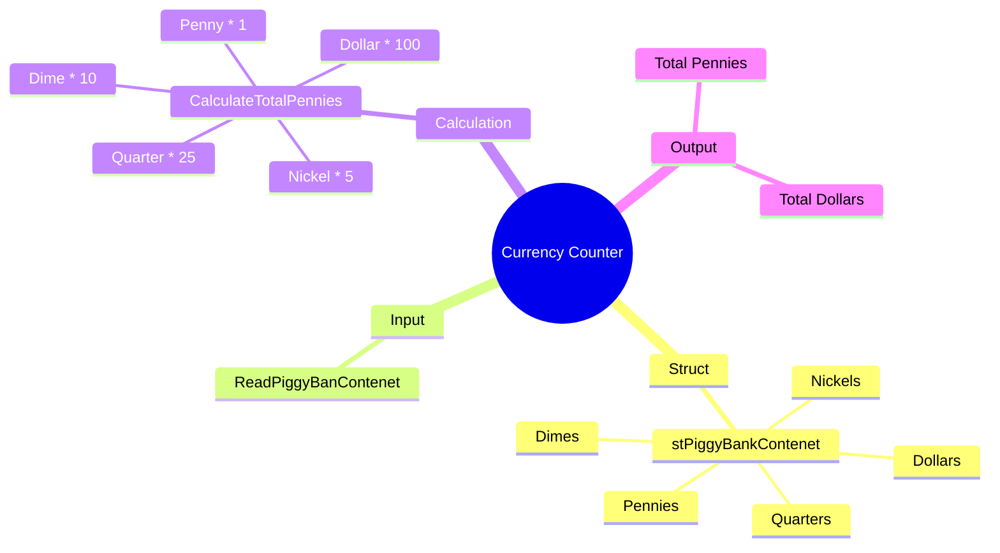

[](https://github.com/aboHuhaed)
[](https://aboHuhaed.github.io)
[](https://linkedin.com/in/ahmed-dawrish)

## Currency Counter – Piggy Bank Calculator

This program simulates a piggy bank counter. It asks the user to enter the number of pennies, nickels, dimes, quarters, and dollar bills, then calculates the total value in pennies and converts it to dollars.

### How It Works

The program uses a `struct` called `stPiggyBankContenet` to group all coin types together. A function `ReadPiggyBanContenet()` prompts the user for each coin count and returns a filled struct. The `CalculateTotalPennies()` function multiplies each coin type by its value in pennies (Penny = 1, Nickel = 5, Dime = 10, Quarter = 25, Dollar = 100) and sums them up. Finally, `main()` displays the total in pennies and converts it to dollars by dividing by 100.

### Code

```cpp
#include <iostream>
#include <string>

using namespace std;
struct stPiggyBankContenet
{
	int Pennies, Nickels, Dimes, Quarters, Dollars;
};

stPiggyBankContenet ReadPiggyBanContenet()
{
	stPiggyBankContenet PiggyBankContent;

    cout << "Please enter the total number of Pennies: " << endl;
    cin >> PiggyBankContent.Pennies;
    cout << "Please enter the total number of Nickels: " << endl;
    cin >> PiggyBankContent.Nickels;
    cout << "Please enter the total number of Dimes: " << endl;
    cin >> PiggyBankContent.Dimes;
    cout << "Please enter the total number of Quarters: " << endl;
    cin >> PiggyBankContent.Quarters;
    cout << "Please enter the total number of Dollar bills: " << endl;
    cin >> PiggyBankContent.Dollars;

    return PiggyBankContent;
}

int CalculateTotalPennies(stPiggyBankContenet PiggyBankContent)
{
    int TotalPennies = PiggyBankContent.Pennies * 1
        + PiggyBankContent.Nickels * 5
        + PiggyBankContent.Dimes * 10
        + PiggyBankContent.Quarters * 25
        + PiggyBankContent.Dollars * 100;
    return TotalPennies;
}

int main()
{
    int TotalPennies = CalculateTotalPennies(ReadPiggyBanContenet());
    cout << endl << "Total Pennies = " << TotalPennies << endl;

    cout << endl << "Total Dollars = $" << (float)TotalPennies / 100 << endl;
}
```

### Concepts Covered

- **Structs**: Grouping related data (coin counts) into a single user-defined type.
- **Function Decomposition**: Separating input (`ReadPiggyBanContenet`), calculation (`CalculateTotalPennies`), and output logic.
- **Type Casting**: Casting `int TotalPennies` to `float` for accurate dollar conversion.
- **Arithmetic Operations**: Multiplying counts by their monetary values and summing.

### Mermaid Mind Map



### Quiz

<details>
<summary>Click to show quiz</summary>

**Q1:** What is the value of one quarter in pennies?
- A) 5
- B) 10
- C) 25
- D) 100

<details>
<summary>Answer</summary>
C) 25
</details>

**Q2:** How does the program convert total pennies to dollars?
- A) Multiply by 100
- B) Divide by 100
- C) Subtract 100
- D) Modulo 100

<details>
<summary>Answer</summary>
B) Divide by 100
</details>

</details>
