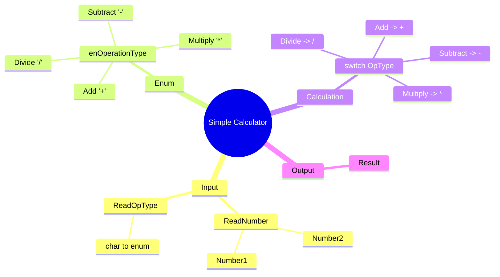

[](https://github.com/aboHuhaed)
[](https://aboHuhaed.github.io)
[](https://linkedin.com/in/ahmed-dawrish)

## Simple Calculator – Arithmetic Operations with Enum & Switch

This program asks the user to enter two numbers and an operation type (+, -, *, /), then performs the corresponding arithmetic operation and displays the result.

### How It Works

The program defines an `enum` called `enOperationType` with values `Add`, `Subtract`, `Multiply`, and `Divide` mapped to their ASCII characters (`'+'`, `'-'`, `'*'`, `'/'`). The user enters two numbers via a reusable `ReadNumber` function, and an operation character via `ReadOpType`. The `Calculate` function uses a `switch` statement on the enum value to perform the correct arithmetic. The result is returned as a `float` to preserve decimal precision in division.

### Code

```cpp
#include <iostream>
#include <string>

using namespace std;
enum enOperationType { Add = '+', Subtract = '-', Multiply = '*', Divide = '/' };

int ReadNumber(string Message)
{
	float Number = 0;
	cout << Message << endl;
	cin >> Number;
	return Number;
}

enOperationType ReadOpType()
{
	char OT = '+';
	cout << "Please enter Operation Type ( +, - , * , / )?\n";
	cin >> OT;
	return (enOperationType)OT ;
}

float Calculate(float Number1, float Number2, enOperationType OpType)
{
	switch (OpType)
	{
	case enOperationType::Add:
		return Number1 + Number2;
	case enOperationType::Subtract:
		return Number1 - Number2;
	case enOperationType::Multiply:
		return Number1 * Number2;
	case enOperationType::Divide:
		return Number1 / Number2;
	default:
		return Number1 + Number2;
	}
}
int main()
{
	float Number1 = ReadNumber("Please enter num 1?");
	float Number2 = ReadNumber("Please enter num 2?");
	enOperationType OpType = ReadOpType();
	cout << endl << "Reasult " << Calculate(Number1, Number2, OpType) << endl;
	return 0;
}
```

### Concepts Covered

- **Enumerations**: Defining named constants for operation types with explicit character values.
- **Switch Statement**: Branching execution based on the selected operation.
- **Type Casting**: Casting a `char` input to the `enOperationType` enum.
- **Function Overloading / Reusability**: Using one `ReadNumber` function for both inputs.
- **Floating-Point Arithmetic**: Using `float` for accurate division results.

### Mermaid Mind Map



### Quiz

<details>
<summary>Click to show quiz</summary>

**Q1:** What C++ feature does the program use to group the four operations?
- A) Struct
- B) Enum
- C) Array
- D) Class

<details>
<summary>Answer</summary>
B) Enum
</details>

**Q2:** What happens if the user enters an invalid operation character?
- A) The program crashes
- B) It defaults to addition
- C) It asks again
- D) It returns 0

<details>
<summary>Answer</summary>
B) It defaults to addition (the `default` case returns `Number1 + Number2`)
</details>

</details>
