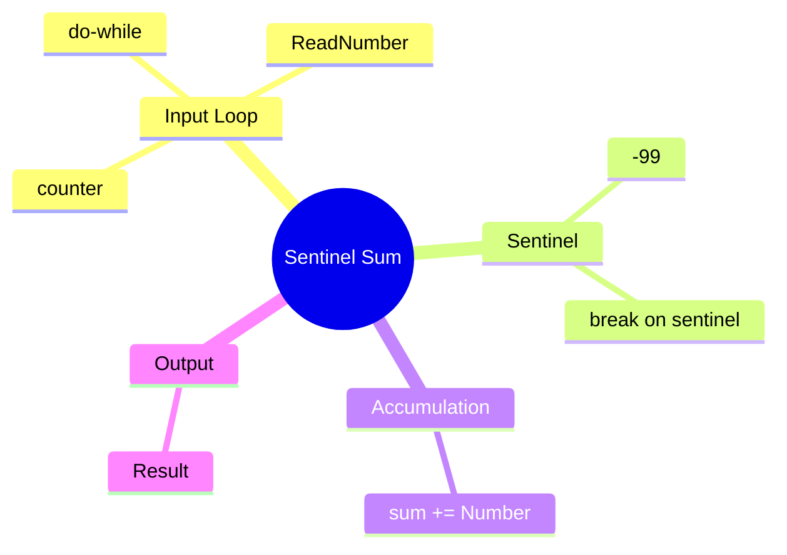

[](https://github.com/aboHuhaed)
[](https://aboHuhaed.github.io)
[](https://linkedin.com/in/ahmed-dawrish)

## Sentinel Sum – Summing Numbers Until Sentinel

This program reads numbers from the user and keeps a running total. It stops reading when the user enters `-99` (the sentinel value), then displays the sum of all entered numbers excluding the sentinel.

### How It Works

The `SumNumbers()` function uses a `do...while` loop to repeatedly ask the user for a number. Inside the loop, a `break` statement exits immediately if the input equals `-99`. Otherwise, the number is added to `sum` and a counter increments for the prompt message. The loop condition also checks for `-99` as a secondary guard. The main function simply calls `SumNumbers()` and prints the result.

### Code

```cpp
#include <iostream>
#include <string>
using namespace std;
float ReadNumber(string Message)
{
    float Number = 0;
    cout << Message;
    cin >> Number;
    return Number;
}

float SumNumbers()
{
    int sum = 0, Number = 0, counter = 1;
    do
    {
        Number = ReadNumber("Please entre Number " + to_string(counter));
        if (Number == -99)
        {
            break;
        }
        sum = Number + sum;
        counter++;
    } while (Number != -99);
    return sum;
}

int main()
{
    cout << endl << "Result = " << SumNumbers() << endl;
}
```

### Concepts Covered

- **Sentinel-Controlled Loops**: Using a special value (`-99`) to terminate input.
- **Do...While Loop**: Executing the body at least once before checking the condition.
- **Break Statement**: Exiting the loop early when the sentinel is detected.
- **String Concatenation**: Using `to_string(counter)` to build dynamic prompt messages.
- **Running Total Pattern**: Accumulating values into a `sum` variable.

### Mermaid Mind Map



### Quiz

<details>
<summary>Click to show quiz</summary>

**Q1:** What is the sentinel value in this program?
- A) 0
- B) 99
- C) -99
- D) -1

<details>
<summary>Answer</summary>
C) -99
</details>

**Q2:** Is the sentinel value included in the final sum?
- A) Yes
- B) No

<details>
<summary>Answer</summary>
B) No — the `break` exits before adding `-99` to the sum.
</details>

</details>
