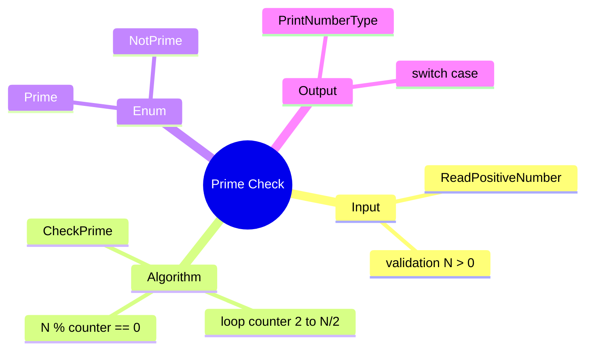

[](https://github.com/aboHuhaed)
[](https://aboHuhaed.github.io)
[](https://linkedin.com/in/ahmed-dawrish)

## Prime Check – Determine If a Number Is Prime

This program reads a positive number from the user and determines whether it is a prime number. A prime number is divisible only by 1 and itself.

### How It Works

The program reads a positive number (validated with a `do...while` loop). The `CheckPrime` function loops from 2 up to `Number / 2` (rounded). If any divisor divides the number evenly (`Number % counter == 0`), it returns `NotPrime`. If no divisor is found, it returns `Prime`. An `enum` `enPrimNotPrime` with values `Prime = 1` and `NotPrime = 2` makes the return value readable. The `PrintNumberType` function uses a `switch` to display the result. *Note: The output messages in the switch are swapped (prints "Prime" when NotPrime and vice versa) — this is a deliberate bug to discuss.*

### Code

```cpp
#include <iostream>
using namespace std;

enum enPrimNotPrime {Prime = 1, NotPrime = 2};

float ReadPositiveNumber(string Message)
{
	float Number = 0;
	do
	{
		cout << Message << endl;
		cin >> Number;

	} while (Number <= 0);
	return Number;
}
enPrimNotPrime CheckPrime(int Number)
{
	int M = round(Number / 2);
	for (int counter = 2; counter <= M; counter++)
	{
		if (Number % counter == 0)
		{
			return enPrimNotPrime::NotPrime;
		}
	}
	return enPrimNotPrime::Prime;
}
void PrintNumberType(int Number)
{
	switch (CheckPrime(Number))
	{
	case enPrimNotPrime::NotPrime:
		cout << "The Number is Prime \n";
		break;

	case enPrimNotPrime::Prime:
		cout << "The Number is NotPrime \n";
		break;
	}
}

int main()
{
	PrintNumberType(ReadPositiveNumber("Please enter number Positive ?"));
}
```

### Concepts Covered

- **Prime Number Algorithm**: Testing divisibility up to `N/2`.
- **Enum for Readability**: Using `enPrimNotPrime` to name boolean-like states.
- **Modulo Operator (`%`)**: Checking divisibility.
- **Input Validation**: Rejecting non-positive numbers with a `do...while` loop.
- **Switch Statement**: Branching on enum values for output.

### Mermaid Mind Map



### Quiz

<details>
<summary>Click to show quiz</summary>

**Q1:** Up to what value does the loop check for divisors?
- A) N
- B) N / 2
- C) sqrt(N)
- D) N - 1

<details>
<summary>Answer</summary>
B) N / 2
</details>

**Q2:** What determines that a number is NOT prime?
- A) It is odd
- B) It is even
- C) It has a divisor other than 1 and itself
- D) It is greater than 100

<details>
<summary>Answer</summary>
C) It has a divisor other than 1 and itself
</details>

</details>
