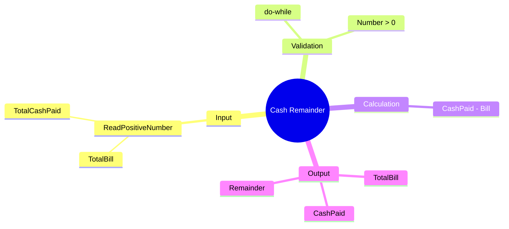

[](https://github.com/aboHuhaed)
[](https://aboHuhaed.github.io)
[](https://linkedin.com/in/ahmed-dawrish)

## Cash Remainder – Calculate Change After Payment

This program reads a total bill amount and the cash paid by the customer, then calculates the remainder (change) to be returned.

### How It Works

Two positive numbers are read: `TotalBill` and `TotalCashPaid`. Both are validated using a `do...while` loop that ensures they are greater than zero. The `CalculateRemainder` function simply subtracts the bill from the cash paid. The result is displayed alongside the original values.

### Code

```cpp
#include <iostream>
#include <string>
using namespace std;

float ReadPositiveNumber(string Message)
{
	float Number = 0;
	do
	{
		cout << Message << endl;
		cin >> Number;

	} while (Number <= 0);
	return Number;
}

float CalculateRemainder(float TotalBill, float TotalCashPaid)
{
	return TotalCashPaid - TotalBill;
}
int main()
{
	float TotalBill = ReadPositiveNumber("Please enter Total Bill?");
	float TotalCashPaid = ReadPositiveNumber("Please enter Total Cash Paid?");
	cout << endl;

	cout << "Total Bill = " << TotalBill << endl;
	cout << "Total Cash Paid = " << TotalCashPaid << endl;

	cout << "Remainder = " << CalculateRemainder(TotalBill, TotalCashPaid) << endl;
	return 0;
}
```

### Concepts Covered

- **Input Validation**: Ensuring inputs are positive using a `do...while` loop.
- **Function Abstraction**: Encapsulating the remainder calculation in a named function.
- **Subtraction Operation**: Basic arithmetic to compute change.
- **Reusable Functions**: `ReadPositiveNumber` is used for both inputs.

### Mermaid Mind Map



### Quiz

<details>
<summary>Click to show quiz</summary>

**Q1:** What does the program calculate?
- A) Total bill with tax
- B) Remainder (change) after payment
- C) Discount amount
- D) Monthly installment

<details>
<summary>Answer</summary>
B) Remainder (change) after payment
</details>

**Q2:** If TotalBill = 150 and CashPaid = 200, what is the remainder?
- A) -50
- B) 50
- C) 150
- D) 200

<details>
<summary>Answer</summary>
B) 50
</details>

</details>
