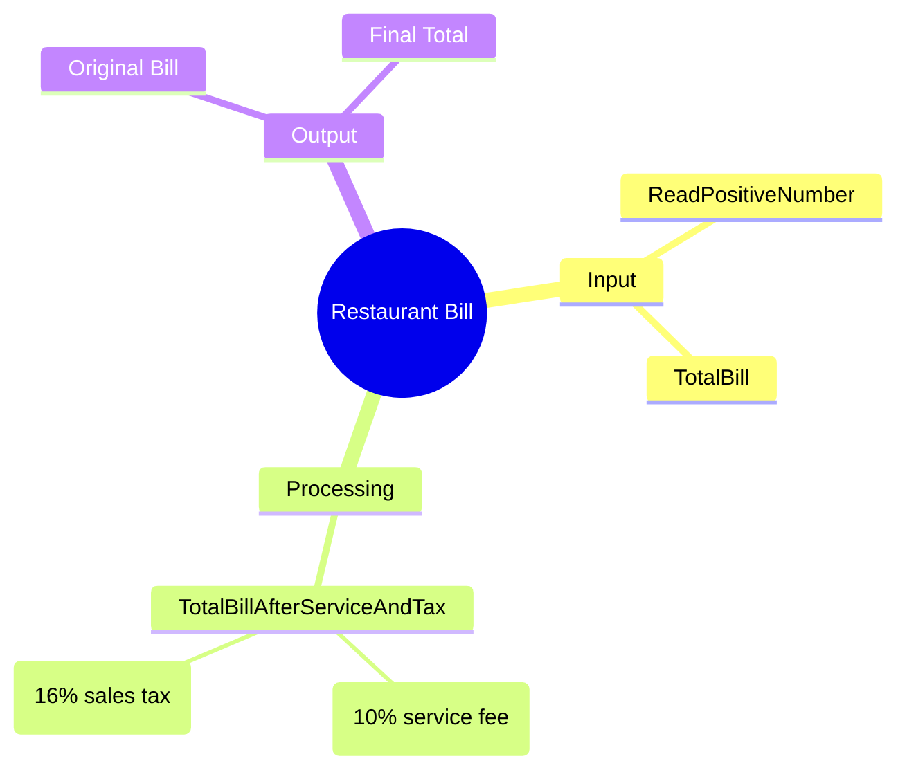

[](https://github.com/aboHuhaed)
[](https://aboHuhaed.github.io)
[](https://linkedin.com/in/ahmed-dawrish)

## Restaurant Bill – Adding Service Fee & Sales Tax

This program reads a bill value, adds a 10% service fee, then adds a 16% sales tax on top of that, and displays the final total.

### How It Works

The user enters a positive bill value. The `TotalBillAfterServiceAndTax` function multiplies the bill by 1.1 to add the 10% service fee, then multiplies the result by 1.16 to add the 16% sales tax. The final amount is printed alongside the original bill.

### Code

```cpp
#include <iostream>
using namespace std;

float ReadPositiveNumber(string Message)
{
	float Number = 0;
	do
	{
		cout << Message << endl;
		cin >> Number;

	} while (Number <= 0);
	return Number;
}

float TotalBillAfterServiceAndTax(float TotalBill)
{
	TotalBill = TotalBill * 1.1;
	TotalBill = TotalBill * 1.16;
	return TotalBill;
}
int main()
{
	float TotalBill = ReadPositiveNumber("Please enter total bill?");
	cout << endl;
	cout << "Total Bill = " << TotalBill << endl;
	cout << "Total Bill After Servie Fee and Sales Tax = "
		<< TotalBillAfterServiceAndTax(TotalBill) << endl;
	return 0;
}
```

### Concepts Covered

- **Percentage Calculation**: Adding 10% (multiply by 1.1) and 16% (multiply by 1.16).
- **Chained Operations**: Applying successive percentage increases.
- **Input Validation**: Ensuring the bill is positive.
- **Function Composition**: Passing the bill through a transformation function.

### Mermaid Mind Map



### Quiz

<details>
<summary>Click to show quiz</summary>

**Q1:** What does multiplying by 1.1 do to the bill?
- A) Adds 1%
- B) Adds 10%
- C) Adds 11%
- D) Adds 100%

<details>
<summary>Answer</summary>
B) Adds 10%
</details>

**Q2:** If the original bill is $100, what is the final total?
- A) $116
- B) $126
- C) $127.60
- D) $110

<details>
<summary>Answer</summary>
C) $127.60 ($100 x 1.1 = $110, $110 x 1.16 = $127.60)
</details>

</details>
