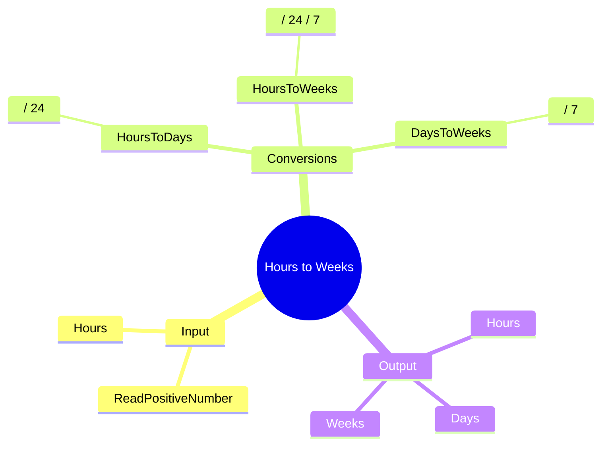

[](https://github.com/aboHuhaed)
[](https://aboHuhaed.github.io)
[](https://linkedin.com/in/ahmed-dawrish)

## Hours to Weeks – Time Unit Conversion

This program reads a number of hours from the user and converts it into days and weeks.

### How It Works

The program reads a positive number of hours. It uses `HoursToDays()` to divide by 24, and `HoursToWeeks()` to divide by 24 then by 7. There is also a `DaysToWeeks()` function which divides days by 7. The results are displayed for all time units.

### Code

```cpp
#include <iostream>
using namespace std;

float ReadPositiveNumber(string Message)
{
	float Number = 0;
	do
	{
		cout << Message << endl;
		cin >> Number;

	} while (Number <= 0);
	return Number;
}

float HoursToDays(float NumberOfHours)
{
	return (float)NumberOfHours / 24;
}

float HoursToWeeks(float NumberOfHours)
{
	return (float)NumberOfHours / 24 / 7;
}

float DaysToWeeks(float NumberOfDays)
{
	return (float)NumberOfDays / 7;
}
int main()
{
	float NumberOfHours = ReadPositiveNumber("Please Enter Number Of Hours?");
	float NumberOfDays = HoursToDays(NumberOfHours);
	float NumberOfWeeks = HoursToWeeks(NumberOfDays);

	cout << endl;
	cout << "Total Hours = " << NumberOfHours << endl;
	cout << "Total Days = " << NumberOfDays << endl;
	cout << "Total weeks = " << HoursToWeeks(NumberOfHours) << endl;

	return 0;
}
```

### Concepts Covered

- **Unit Conversion**: Dividing hours by 24 for days, then by 7 for weeks.
- **Explicit Type Casting**: Using `(float)` to ensure floating-point division.
- **Multiple Conversion Functions**: Separating `HoursToDays`, `HoursToWeeks`, and `DaysToWeeks`.
- **Input Validation**: Using a `do...while` loop to ensure a positive input.

### Mermaid Mind Map



### Quiz

<details>
<summary>Click to show quiz</summary>

**Q1:** How many hours are in one week?
- A) 24
- B) 48
- C) 168
- D) 7

<details>
<summary>Answer</summary>
C) 168 (24 hours/day x 7 days/week)
</details>

**Q2:** If you have 168 hours, how many weeks is that?
- A) 7
- B) 24
- C) 1
- D) 0.5

<details>
<summary>Answer</summary>
C) 1 week
</details>

</details>
