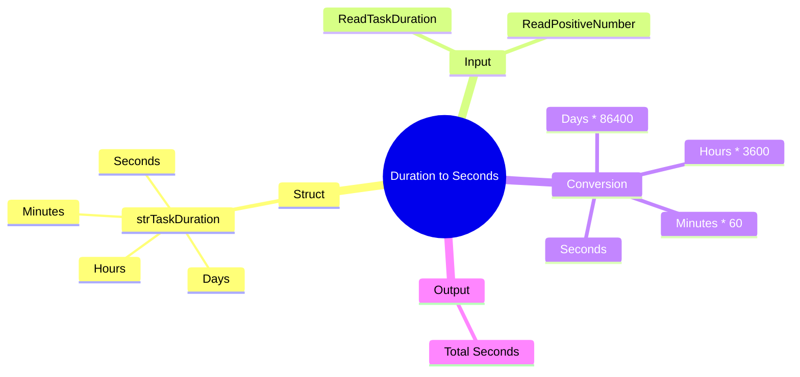

[](https://github.com/aboHuhaed)
[](https://aboHuhaed.github.io)
[](https://linkedin.com/in/ahmed-dawrish)

## Duration to Seconds – Converting Time to Seconds

This program reads a task duration in days, hours, minutes, and seconds, then converts the entire duration into total seconds.

### How It Works

A `struct` called `strTaskDuration` holds the four time components. The `ReadTaskDuration()` function fills this struct by asking the user for each component. The `TaskDurationSeconds()` function converts each component to seconds — days to seconds (`* 24 * 60 * 60`), hours to seconds (`* 60 * 60`), minutes to seconds (`* 60`), then sums them all with the seconds component. The result is printed in `main()`.

### Code

```cpp
#include <iostream>
using namespace std;

struct strTaskDuration
{
	int NumberOfDays, NumberOfHours, NumberOfMinutes, NumberOfSeconds;
};

int ReadPositiveNumber(string Message)
{
	int Number = 0;
	do
	{
		cout << Message << endl;
		cin >> Number;

	} while (Number <= 0);
	return Number;
}

strTaskDuration ReadTaskDuration()
{
	strTaskDuration TaskDuration;
	TaskDuration.NumberOfDays = ReadPositiveNumber("Please Enter Number of Days ? ");
	TaskDuration.NumberOfHours = ReadPositiveNumber("Please Enter Number of Hours ? ");
	TaskDuration.NumberOfMinutes = ReadPositiveNumber("Please Enter Number of Minutes ? ");
	TaskDuration.NumberOfSeconds = ReadPositiveNumber("Please Enter Number of Seconds ? ");

	return TaskDuration;
}

int TaskDurationSeconds(strTaskDuration TaskDuration)
{
	int DurationsInSeconds = 0;

	DurationsInSeconds = TaskDuration.NumberOfDays * 24 * 60 * 60;
	DurationsInSeconds += TaskDuration.NumberOfHours *  60 * 60;
	DurationsInSeconds += TaskDuration.NumberOfMinutes * 60;
	DurationsInSeconds += TaskDuration.NumberOfSeconds ;

	return DurationsInSeconds;
}

int main()
{
	cout << "\n Task Duration In Seconds : " << TaskDurationSeconds(ReadTaskDuration());
	cout << endl;
	return 0;
}
```

### Concepts Covered

- **Structs**: Grouping related time fields into a single type.
- **Unit Conversion Logic**: Days → hours → minutes → seconds.
- **Compound Assignment**: Using `+=` to accumulate the total.
- **Nested Function Calls**: Passing the result of `ReadTaskDuration()` directly into `TaskDurationSeconds()`.

### Mermaid Mind Map



### Quiz

<details>
<summary>Click to show quiz</summary>

**Q1:** How many seconds are in one hour?
- A) 60
- B) 600
- C) 3600
- D) 86400

<details>
<summary>Answer</summary>
C) 3600
</details>

**Q2:** If a task takes 1 day, 0 hours, 0 minutes, and 0 seconds, how many seconds is that?
- A) 3600
- B) 86400
- C) 1440
- D) 24

<details>
<summary>Answer</summary>
B) 86400
</details>

</details>
