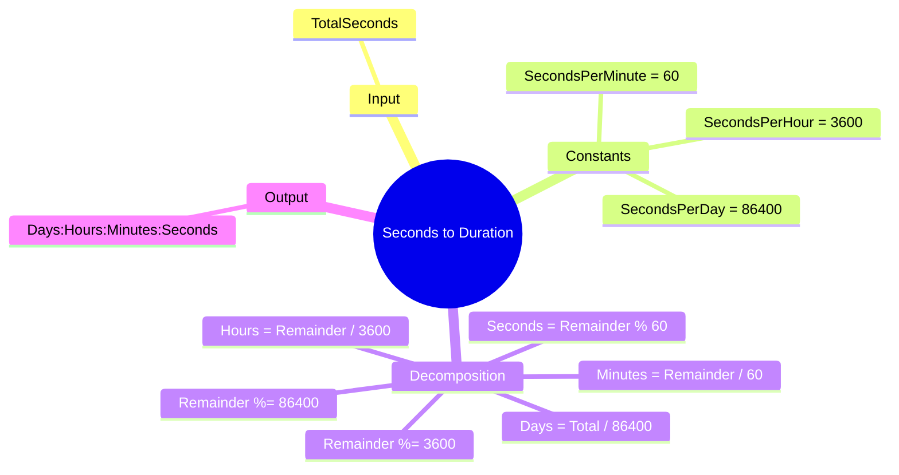

[](https://github.com/aboHuhaed)
[](https://aboHuhaed.github.io)
[](https://linkedin.com/in/ahmed-dawrish)

## Seconds to Duration – Breaking Seconds into Days, Hours, Minutes, Seconds

This program is the inverse of Lesson 42. It reads a total number of seconds and breaks it down into days, hours, minutes, and remaining seconds.

### How It Works

Constants are defined for `SecondsPerDay` (86400), `SecondsPerHour` (3600), and `SecondsPerMinute` (60). The `SecondsToTaskDuration` function uses integer division (`floor`) and the modulo operator (`%`) to extract each component sequentially:
1. Divide total seconds by `SecondsPerDay` to get days; store the remainder.
2. Divide the remainder by `SecondsPerHour` to get hours; store the new remainder.
3. Divide by `SecondsPerMinute` to get minutes; the final remainder is seconds.
The result is printed in the format `days:hours:minutes:seconds`.

### Code

```cpp
#include <iostream>
using namespace std;

struct strTaskDuration
{
	int NumberOfDays, NumberOfHours, NumberOfMinutes, NumberOfSeconds;
};

int ReadPositiveNumber(string Message)
{
	int Number = 0;
	do
	{
		cout << Message << endl;
		cin >> Number;

	} while (Number <= 0);
	return Number;
}
strTaskDuration SecondsToTaskDuration(int TotalSeconds)
{
	strTaskDuration TaskDuration;
	const int SecondsPerDay = 24 * 60 * 60;
	const int SecondsPerHour =  60 * 60;
	const int SecondsPerMinute = 60 ;

	int Remainder = 0;
	TaskDuration.NumberOfDays = floor(TotalSeconds / SecondsPerDay);
	Remainder = TotalSeconds % SecondsPerDay;

	TaskDuration.NumberOfHours = floor(Remainder / SecondsPerHour);
	Remainder = Remainder % SecondsPerHour;

	TaskDuration.NumberOfMinutes = floor(Remainder / SecondsPerMinute);
	Remainder = Remainder % SecondsPerMinute;

	TaskDuration.NumberOfSeconds = Remainder;
	return TaskDuration;
}

void PrintTaskDurationDetails(strTaskDuration TaskDuration)
{
	cout << "\n";
	cout << TaskDuration.NumberOfDays << ":"
		<< TaskDuration.NumberOfHours << ":"
		<< TaskDuration.NumberOfMinutes << ":"
		<< TaskDuration.NumberOfSeconds << "\n";
}

int main()
{
	int TotalSeconds = ReadPositiveNumber("Please enter total seconds?");
	PrintTaskDurationDetails(SecondsToTaskDuration(TotalSeconds));
	return 0;
}
```

### Concepts Covered

- **Inverse Conversion**: Decomposing a large unit into smaller named units.
- **Modulo Operator (`%`)**: Capturing the remainder after extracting each unit.
- **Integer Division**: Using `floor` for whole-number division.
- **Constants**: Defining named constants for readability and maintainability.
- **Struct for Return**: Returning multiple values as a structured type.

### Mermaid Mind Map



### Quiz

<details>
<summary>Click to show quiz</summary>

**Q1:** What operator is used to get the remainder after extracting a time unit?
- A) `/`
- B) `*`
- C) `%`
- D) `+`

<details>
<summary>Answer</summary>
C) `%` (modulo)
</details>

**Q2:** If you input 90061 seconds, what is the output?
- A) 1:1:1:1
- B) 1:0:1:1
- C) 0:1:1:1
- D) 1:1:0:1

<details>
<summary>Answer</summary>
A) 1:1:1:1 (86400 + 3600 + 60 + 1 = 90061)
</details>

</details>
