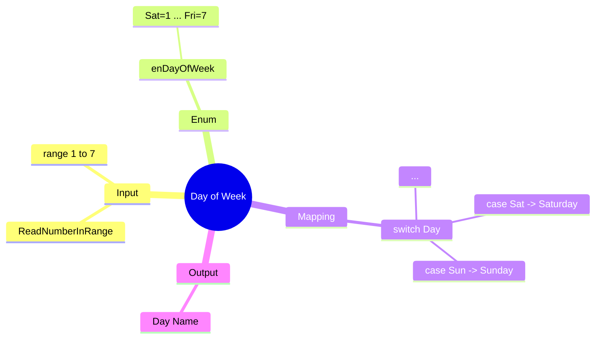

[](https://github.com/aboHuhaed)
[](https://aboHuhaed.github.io)
[](https://linkedin.com/in/ahmed-dawrish)

## Day of Week – Map Numbers to Day Names

This program asks the user to enter a number from 1 to 7 and prints the corresponding day of the week (Saturday through Friday). Invalid input prompts the user to try again.

### How It Works

An `enum` `enDayOfWeek` maps the numbers 1–7 to day names (Sat through Fri). The `ReadNumberInRange` function uses a `do...while` loop to enforce input between 1 and 7. The `GetDayOfWeek` function uses a `switch` statement on the enum value to return the corresponding day name string. The result is printed in `main()`.

### Code

```cpp
#include <iostream>
using namespace std;

enum enDayOfWeek {Sat = 1, Sun = 2, Mon = 3 , Tue =4 , Wed = 5 , Thu = 6 , Fri =7};

int ReadNumberInRange(string Message, int From, int To)
{
	int Number = 0;
	do
	{
		cout << Message << endl;
		cin >> Number;

	} while (Number < From || Number > To);
	return Number;
}

enDayOfWeek ReadDayOfWeek()
{
	return (enDayOfWeek)ReadNumberInRange("Please enter day number (Sat=1, Sun=2, Mon=3, Tue=4, Wed=5, Thu=6, Fri=7)?", 1, 7);
}

string GetDayOfWeek(enDayOfWeek Day)
{
	switch (Day)
	{
    case enDayOfWeek::Sat:
        return "Saturday";
    case enDayOfWeek::Sun:
        return "Sunday";
    case enDayOfWeek::Mon:
        return "Monday";
    case enDayOfWeek::Tue:
        return "Tuesday";
    case enDayOfWeek::Wed:
        return "Wednesday";
    case enDayOfWeek::Thu:
        return "Thursday";
    case enDayOfWeek::Fri:
        return "Friday";
    default:
        return "Not a valid Day";
    }
}
int main()
{
    cout << GetDayOfWeek(ReadDayOfWeek());
}
```

### Concepts Covered

- **Enum for Mapping**: Associating integer codes with meaningful names.
- **Range Validation**: Ensuring input falls within a specific range.
- **Switch Statement**: Mapping each enum value to a string output.
- **Reusable Input Function**: `ReadNumberInRange` can be used by other programs needing bounded input.

### Mermaid Mind Map



### Quiz

<details>
<summary>Click to show quiz</summary>

**Q1:** What number corresponds to Wednesday?
- A) 3
- B) 4
- C) 5
- D) 6

<details>
<summary>Answer</summary>
C) 5
</details>

**Q2:** What happens if the user enters 8?
- A) It prints "Wrong Day"
- B) The program re-asks for input
- C) It crashes
- D) It prints "Friday"

<details>
<summary>Answer</summary>
B) The `ReadNumberInRange` loop re-asks until input is between 1 and 7.
</details>

</details>
