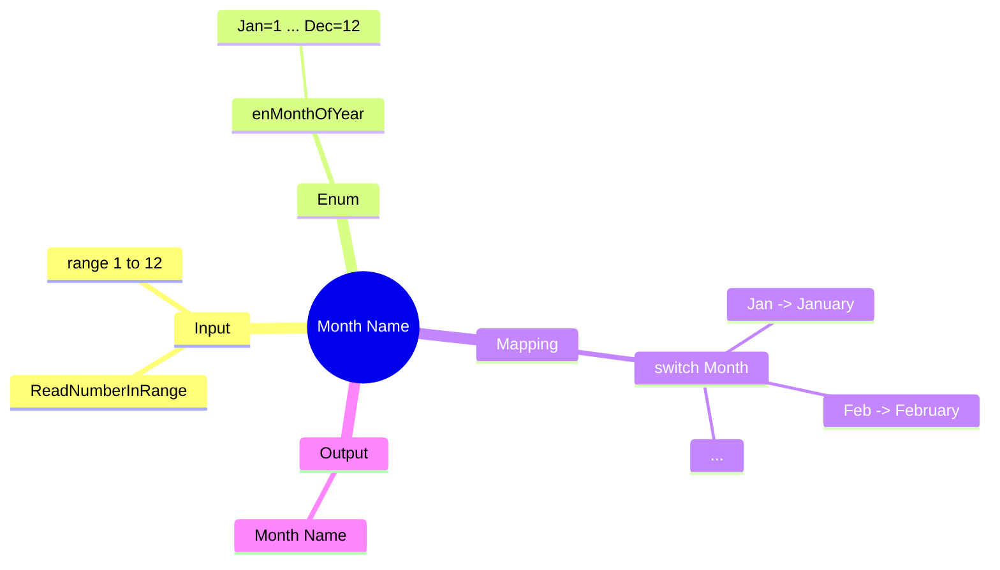

[](https://github.com/aboHuhaed)
[](https://aboHuhaed.github.io)
[](https://linkedin.com/in/ahmed-dawrish)

## Month Name – Map Numbers to Month Names

This program asks the user to enter a number from 1 to 12 and prints the corresponding month name (January through December). Invalid input prompts the user to try again.

### How It Works

An `enum` `enMonthOfYear` maps numbers 1–12 to month abbreviations (Jan through Dec). The `ReadNumberInRange` function validates that input is between 1 and 12 using a `do...while` loop. The `GetMonthOfYear` function uses a `switch` statement to return the full month name string for each enum value.

### Code

```cpp
#include <iostream>
using namespace std;

enum enMonthOfYear {
    Jan = 1, Feb = 2, Mar = 3, Apr = 4, May = 5,
    Jun = 6, Jul = 7, Aug = 8, Sep = 9, Oct = 10,
    Nov = 11, Dec = 12
};

int ReadNumberInRange(string Message, int From, int To)
{
    int Number = 0;
    do
    {
        cout << Message << endl;
        cin >> Number;

    } while (Number < From || Number > To);
    return Number;
}

enMonthOfYear ReadMonthOfYear()
{
    return (enMonthOfYear)ReadNumberInRange("Please enter a month [1 to 12]:", 1, 12);
}
string GetMonthOfYear(enMonthOfYear Month)
{
switch (Month)
{
case enMonthOfYear::Jan:
    return "January";
case enMonthOfYear::Feb:
    return "February";
case enMonthOfYear::Mar:
    return "March";
case enMonthOfYear::Apr:
    return "April";
case enMonthOfYear::May:
    return "May";
case enMonthOfYear::Jun:
    return "June";
case enMonthOfYear::Jul:
    return "July";
case enMonthOfYear::Aug:
    return "August";
case enMonthOfYear::Sep:
    return "September";
case enMonthOfYear::Oct:
    return "October";
case enMonthOfYear::Nov:
    return "November";
case enMonthOfYear::Dec:
    return "December";
default:
    return "Not a valid Month";
}
}
int main()
{
    cout << GetMonthOfYear(ReadMonthOfYear());
}
```

### Concepts Covered

- **Enum with Sequential Values**: Mapping integers 1–12 to named constants.
- **Range Validation**: Bounding input with `ReadNumberInRange`.
- **Switch with Multiple Cases**: Handling all 12 months with individual `case` labels.
- **Input-to-Output Mapping**: Translating a numeric code to a human-readable string.

### Mermaid Mind Map



### Quiz

<details>
<summary>Click to show quiz</summary>

**Q1:** What number corresponds to August?
- A) 6
- B) 7
- C) 8
- D) 9

<details>
<summary>Answer</summary>
C) 8
</details>

**Q2:** What does the program do if the user enters 0?
- A) Prints "Not a valid Month"
- B) Re-asks for input repeatedly
- C) Prints "January"
- D) Exits

<details>
<summary>Answer</summary>
B) The `do...while` loop in `ReadNumberInRange` re-asks because 0 is outside 1..12.
</details>

</details>
