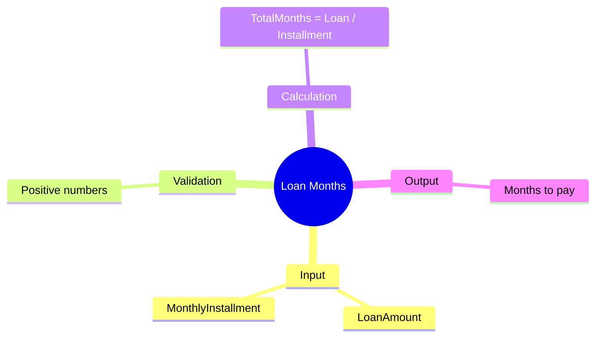

[](https://github.com/aboHuhaed)
[](https://aboHuhaed.github.io)
[](https://linkedin.com/in/ahmed-dawrish)

## Loan Months – Calculate Loan Repayment Period

This program reads a loan amount and a monthly installment amount, then calculates how many months it will take to repay the loan.

### How It Works

Two positive numbers are read: `LoanAmount` and `MonthlyInstallment`. The `TotalMonths` function divides the loan amount by the monthly installment. The result is displayed as the total months needed for repayment.

### Code

```cpp
#include <iostream>
#include <string>
using namespace std;

float ReadPositiveNumber(string Message)
{
	float Number = 0;
	do
	{
		cout << Message << endl;
		cin >> Number;

	} while (Number <= 0);
	return Number;
}

float TotalMonths(float LoanAmount, float MonthlyInstallment)
{
	return (float)LoanAmount / MonthlyInstallment;
}
int main()
{
	float LoanAmount = ReadPositiveNumber("Please Enter Loan Amount?");
	float MonthlyInstallment = ReadPositiveNumber("Please Enter Monthly Installment?");

	cout << "\nTotal Months to pay = " << TotalMonths(LoanAmount, MonthlyInstallment) << endl;
	cout << endl;
	return 0;
}
```

### Concepts Covered

- **Division for Rate Calculation**: LoanAmount / MonthlyInstallment gives the number of periods.
- **Input Validation**: Ensuring positive numbers for financial calculations.
- **Type Casting**: Explicit `(float)` cast for precise division.

### Mermaid Mind Map



### Quiz

<details>
<summary>Click to show quiz</summary>

**Q1:** How do you calculate the number of months to repay a loan given the monthly payment?
- A) LoanAmount x MonthlyInstallment
- B) LoanAmount / MonthlyInstallment
- C) LoanAmount + MonthlyInstallment
- D) LoanAmount - MonthlyInstallment

<details>
<summary>Answer</summary>
B) LoanAmount / MonthlyInstallment
</details>

**Q2:** If LoanAmount = $10,000 and MonthlyInstallment = $500, how many months does it take?
- A) 10
- B) 20
- C) 50
- D) 100

<details>
<summary>Answer</summary>
B) 20 months (10000 / 500 = 20)
</details>

</details>
