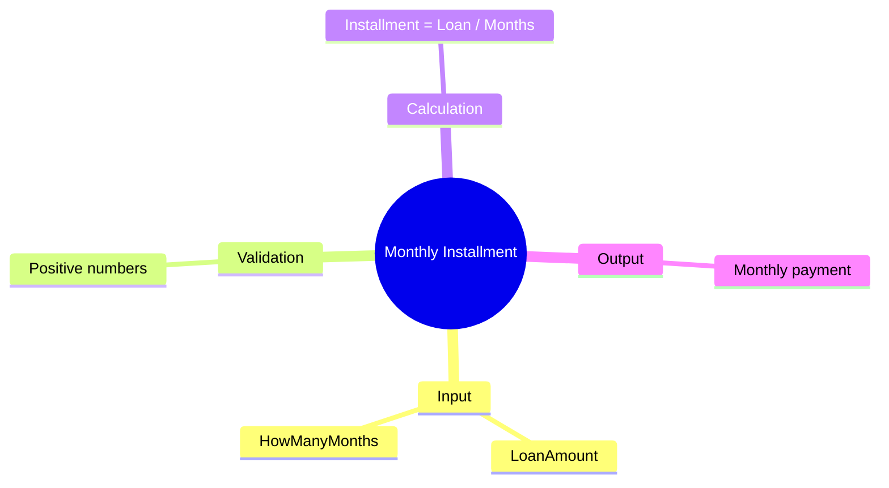

[](https://github.com/aboHuhaed)
[](https://aboHuhaed.github.io)
[](https://linkedin.com/in/ahmed-dawrish)

## Monthly Installment – Calculate Monthly Loan Payment

This program reads a loan amount and the number of months, then calculates the monthly installment amount.

### How It Works

Two positive numbers are read: `LoanAmount` and `HowManyMonths`. The `TotalMonths` function divides the loan amount by the number of months, giving the monthly payment. The result is displayed.

### Code

```cpp
#include <iostream>
#include <string>
using namespace std;

float ReadPositiveNumber(string Message)
{
	float Number = 0;
	do
	{
		cout << Message << endl;
		cin >> Number;

	} while (Number <= 0);
	return Number;
}

float TotalMonths(float LoanAmount, float HowManyMonths)
{
	return (float)LoanAmount / HowManyMonths;
}
int main()
{
	float LoanAmount = ReadPositiveNumber("Please Enter Loan Amount?");
	float HowManyMonths = ReadPositiveNumber("How Many Months ?");

	cout << "\nTotal Months to pay = " << TotalMonths(LoanAmount, HowManyMonths) << endl;
	cout << endl;
	return 0;
}
```

### Concepts Covered

- **Division for Rate Calculation**: LoanAmount / Months gives the periodic payment.
- **Input Validation**: Ensuring positive numbers.
- **Clear Function Naming**: `TotalMonths` is used but actually computes the monthly installment amount.

### Mermaid Mind Map



### Quiz

<details>
<summary>Click to show quiz</summary>

**Q1:** How do you calculate the monthly installment for a loan?
- A) LoanAmount x NumberOfMonths
- B) LoanAmount / NumberOfMonths
- C) LoanAmount + NumberOfMonths
- D) LoanAmount - NumberOfMonths

<details>
<summary>Answer</summary>
B) LoanAmount / NumberOfMonths
</details>

**Q2:** If LoanAmount = $12,000 and the term is 12 months, what is the monthly installment?
- A) $500
- B) $1000
- C) $1200
- D) $600

<details>
<summary>Answer</summary>
B) $1000 (12000 / 12 = 1000)
</details>

</details>
