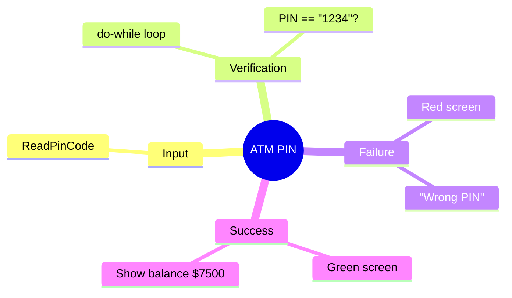

[](https://github.com/aboHuhaed)
[](https://aboHuhaed.github.io)
[](https://linkedin.com/in/ahmed-dawrish)

## ATM PIN – Simple PIN Verification

This program simulates an ATM login by asking the user for a PIN code. If the PIN matches "1234", it displays the account balance and turns the screen green. Otherwise, it shows an error with a red screen and re-prompts indefinitely.

### How It Works

The `ReadPinCode()` function reads a string PIN from the user. The `Login()` function runs a `do...while` loop that keeps asking for the PIN until the correct one ("1234") is entered. On failure, it sets the console color to red (via `system("color 4f")`). On success, `main()` sets the console to green and displays a balance of $7500.

### Code

```cpp
#include <iostream>
using namespace std;
string ReadPinCode()
{
    string PinCode;
    cout << "Please enter PIN code \n";
    cin >> PinCode;

    return PinCode;
}

bool Login()
{
    string PinCode;
    do
    {
        PinCode = ReadPinCode();

        if (PinCode == "1234")
        {
            return 1;
        }
        else
        {
            cout << "\nWrong PIN\n";
            system("color 4f"); // red screen
        }

    } while (PinCode != "1234");
}
int main()
{
    if (Login())
    {
        system("color 2f");
        cout << "\n your account balance is " << 7500 << '\n';
    };
    return 0;
}
```

### Concepts Covered

- **String Comparison**: Checking if the input PIN matches the hardcoded value `"1234"`.
- **Infinite Loop with Break Condition**: The `do...while` loops until the correct PIN is entered.
- **Console Manipulation**: Using `system("color ...")` to change terminal colors.
- **Boolean Return**: `Login()` returns `true` (1) on success.
- **Sentinel-Based Input**: Indefinite re-prompting until the correct sentinel value is entered.

### Mermaid Mind Map



### Quiz

<details>
<summary>Click to show quiz</summary>

**Q1:** What is the correct PIN code for this ATM program?
- A) 0000
- B) 4321
- C) 1234
- D) 1111

<details>
<summary>Answer</summary>
C) 1234
</details>

**Q2:** What happens when the user enters the wrong PIN?
- A) The program exits
- B) The screen turns red and it re-asks
- C) The balance is shown
- D) The screen turns green

<details>
<summary>Answer</summary>
B) The screen turns red (`system("color 4f")`) and it re-asks for the PIN.
</details>

</details>
