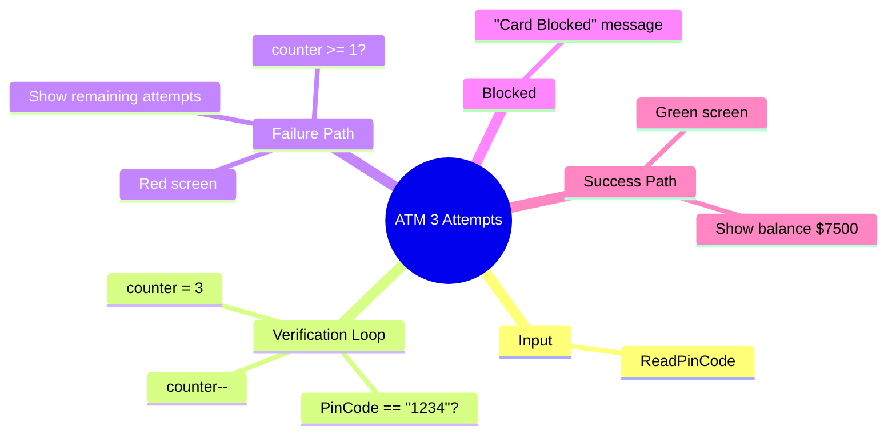

[](https://github.com/aboHuhaed)
[](https://aboHuhaed.github.io)
[](https://linkedin.com/in/ahmed-dawrish)

## ATM 3 Attempts – PIN Verification with Limited Tries

This program extends the ATM PIN concept by limiting the user to 3 attempts. After 3 wrong tries, the card is blocked and a message asks the user to call the bank.

### How It Works

A `counter` starts at 3 and decrements each time the `do...while` loop runs. If the PIN matches "1234", `Login()` returns `true`. On failure, the screen turns red and the remaining attempts are shown. The loop continues while `counter >= 1` and the PIN is wrong. After the loop, if login failed, `main()` prints a card-blocked message.

### Code

```cpp
#include <iostream>
using namespace std;
string ReadPinCode()
{
    string PinCode;
    cout << "Please enter PIN code \n";
    cin >> PinCode;

    return PinCode;
}

bool Login()
{
    string PinCode;
    int counter = 3;
    do
    {
        counter--;
        PinCode = ReadPinCode();

        if (PinCode == "1234")
        {
            return 1;
        }
        else
        {
            system("color 4f");
            cout << "\nWrong PIN\n" << counter << "More \n";
        }

    } while (counter >= 1 && PinCode != "1234");
    return 0;
}

int main()
{
    if (Login())
    {
        system("color 2f");
        cout << "\n your account balance is " << 7500 << '\n';
    }
    else
    {
        cout << "\n Car Blocked call the bank for help\n";
    }
    return 0;
}
```

### Concepts Covered

- **Limited Attempts**: Using a counter that decrements to restrict tries.
- **Compound Loop Condition**: `counter >= 1 && PinCode != "1234"`.
- **Early Return on Success**: Exiting the function immediately when the PIN is correct.
- **User Feedback**: Displaying remaining attempts after each wrong guess.
- **Dual Output Paths**: Success shows balance; failure shows blocked message.

### Mermaid Mind Map



### Quiz

<details>
<summary>Click to show quiz</summary>

**Q1:** How many attempts does the user get before the card is blocked?
- A) 1
- B) 2
- C) 3
- D) Unlimited

<details>
<summary>Answer</summary>
C) 3
</details>

**Q2:** What message is displayed after 3 wrong PIN attempts?
- A) "Try again"
- B) "Card Blocked call the bank for help"
- C) "Access granted"
- D) "Wrong PIN"

<details>
<summary>Answer</summary>
B) "Card Blocked call the bank for help"
</details>

</details>
