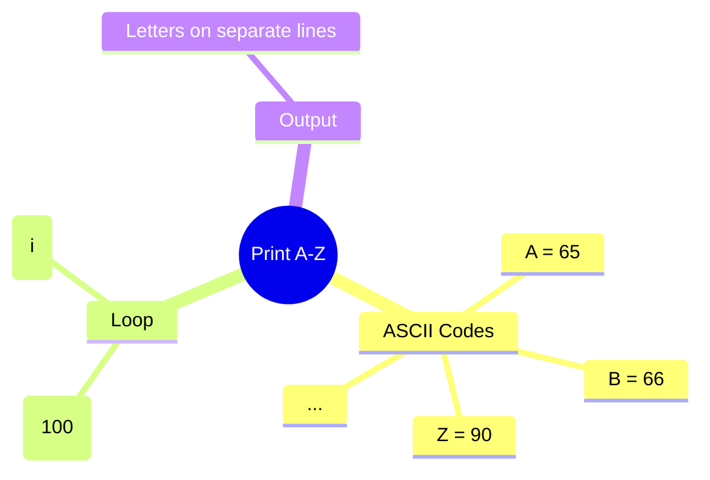

[](https://github.com/aboHuhaed)
[](https://aboHuhaed.github.io)
[](https://linkedin.com/in/ahmed-dawrish)

## Print A-Z – Display Alphabet Using ASCII Codes

This program prints all uppercase letters from A to Z using their ASCII integer codes.

### How It Works

The `PrintLettersAtoZ()` function uses a `for` loop starting at 65 (ASCII code for 'A') up to 90 (ASCII code for 'Z'). Each integer is cast to `char` and printed on a new line. *Note: The current code loops up to 100 (beyond 'Z'), which will print extra non-alphabetic characters — this is a logic bug to discuss.*

### Code

```cpp
#include <iostream>
using namespace std;
void PrintLettersAtoZ()
{
    for (int i = 65; i <= 100; i++)
    {
        cout << char(i) << endl;
    }
}
int main()
{
    PrintLettersAtoZ();
    return 0;
}
```

### Concepts Covered

- **ASCII Codes**: Printable characters have numeric codes (A=65, Z=90).
- **Explicit Type Casting**: `char(i)` converts the integer ASCII code to its character representation.
- **For Loop**: Iterating through a numeric range to print sequential characters.
- **Character Output**: Printing characters to the console.

### Mermaid Mind Map



### Quiz

<details>
<summary>Click to show quiz</summary>

**Q1:** What is the ASCII code for the letter 'A'?
- A) 64
- B) 65
- C) 66
- D) 97

<details>
<summary>Answer</summary>
B) 65
</details>

**Q2:** What ASCII code does the letter 'Z' correspond to?
- A) 90
- B) 91
- C) 89
- D) 100

<details>
<summary>Answer</summary>
A) 90
</details>

</details>
