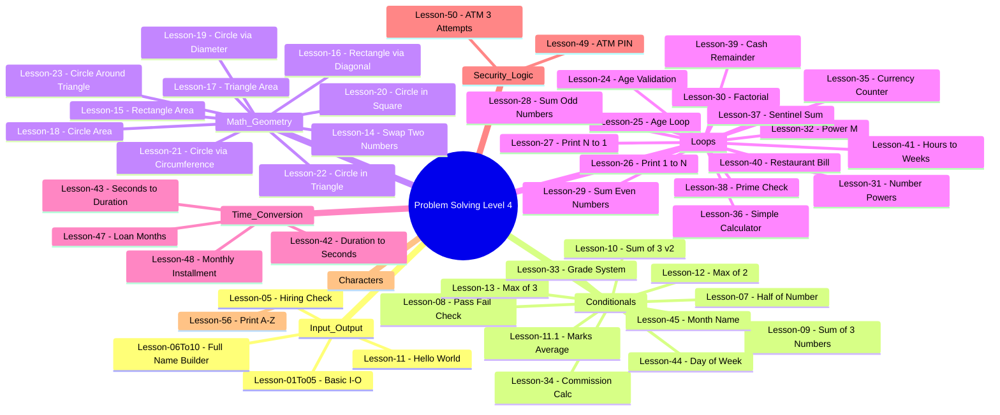

## Problem Solving Level 4

A comprehensive collection of 48 C++ problem-solving exercises covering fundamental programming concepts — from basic I/O and conditionals to loops, functions, enums, and math algorithms.

## Lessons

<strong>📥 I/O & Basics (Lessons 01To05 — 11)</strong>

| Lesson | Topic |
|--------|-------|
| [Lesson-01To05 — Basic I-O](Lesson-01To05%20-%20Basic%20I-O/README.md) | Console input/output fundamentals |
| [Lesson-05 — Hiring Check](Lesson-05%20-%20Hiring%20Check/README.md) | Age validation for hiring |
| [Lesson-06To10 — Full Name Builder](Lesson-06To10%20-%20Full%20Name%20Builder/README.md) | String concatenation |
| [Lesson-07 — Half of Number](Lesson-07%20-%20Half%20of%20Number/README.md) | Division and output |
| [Lesson-08 — Pass Fail Check](Lesson-08%20-%20Pass%20Fail%20Check/README.md) | Conditional pass/fail |
| [Lesson-09 — Sum of 3 Numbers](Lesson-09%20-%20Sum%20of%203%20Numbers/README.md) | Summation |
| [Lesson-10 — Sum of 3 v2](Lesson-10%20-%20Sum%20of%203%20v2/README.md) | Summation variant |
| [Lesson-11 — Hello World](Lesson-11%20-%20Hello%20World/README.md) | First program |
| [Lesson-11.1 — Marks Average](Lesson-11.1%20-%20Marks%20Average/README.md) | Averaging marks |

<strong>⚖️ Conditionals (Lessons 12 — 14, 33 — 34, 44 — 45)</strong>

| Lesson | Topic |
|--------|-------|
| [Lesson-12 — Max of 2](Lesson-12%20-%20Max%20of%202/README.md) | Maximum of two numbers |
| [Lesson-13 — Max of 3](Lesson-13%20-%20Max%20of%203/README.md) | Maximum of three numbers |
| [Lesson-14 — Swap Two Numbers](Lesson-14%20-%20Swap%20Two%20Numbers/README.md) | Swapping values |
| [Lesson-33 — Grade System](Lesson-33%20-%20Grade%20System/README.md) | Letter grade from score |
| [Lesson-34 — Commission Calc](Lesson-34%20-%20Commission%20Calc/README.md) | Tiered commission |
| [Lesson-44 — Day of Week](Lesson-44%20-%20Day%20of%20Week/README.md) | Map number to day |
| [Lesson-45 — Month Name](Lesson-45%20-%20Month%20Name/README.md) | Map number to month |

<strong>📐 Math & Geometry (Lessons 15 — 23)</strong>

| Lesson | Topic |
|--------|-------|
| [Lesson-15 — Rectangle Area](Lesson-15%20-%20Rectangle%20Area/README.md) | Area of rectangle |
| [Lesson-16 — Rectangle via Diagonal](Lesson-16%20-%20Rectangle%20via%20Diagonal/README.md) | Area using diagonal |
| [Lesson-17 — Triangle Area](Lesson-17%20-%20Triangle%20Area/README.md) | Triangle area calculation |
| [Lesson-18 — Circle Area](Lesson-18%20-%20Circle%20Area/README.md) | Circle area from radius |
| [Lesson-19 — Circle via Diameter](Lesson-19%20-%20Circle%20via%20Diameter/README.md) | Circle area from diameter |
| [Lesson-20 — Circle in Square](Lesson-20%20-%20Circle%20in%20Square/README.md) | Inscribed circle |
| [Lesson-21 — Circle via Circumference](Lesson-21%20-%20Circle%20via%20Circumference/README.md) | Area from circumference |
| [Lesson-22 — Circle in Triangle](Lesson-22%20-%20Circle%20in%20Triangle/README.md) | Incircle of triangle |
| [Lesson-23 — Circle Around Triangle](Lesson-23%20-%20Circle%20Around%20Triangle/README.md) | Circumcircle of triangle |

<strong>🔄 Loops (Lessons 24 — 32, 35 — 41)</strong>

| Lesson | Topic |
|--------|-------|
| [Lesson-24 — Age Validation](Lesson-24%20-%20Age%20Validation/README.md) | Validate age range |
| [Lesson-25 — Age Loop](Lesson-25%20-%20Age%20Loop/README.md) | Repeat until valid |
| [Lesson-26 — Print 1 to N](Lesson-26%20-%20Print%201%20to%20N/README.md) | Ascending loop |
| [Lesson-27 — Print N to 1](Lesson-27%20-%20Print%20N%20to%201/README.md) | Descending loop |
| [Lesson-28 — Sum Odd Numbers](Lesson-28%20-%20Sum%20Odd%20Numbers/README.md) | Sum odds with enum |
| [Lesson-29 — Sum Even Numbers](Lesson-29%20-%20Sum%20Even%20Numbers/README.md) | Sum evens with condition |
| [Lesson-30 — Factorial](Lesson-30%20-%20Factorial/README.md) | N! calculation |
| [Lesson-31 — Number Powers](Lesson-31%20-%20Number%20Powers/README.md) | N², N³, N⁴ |
| [Lesson-32 — Power M](Lesson-32%20-%20Power%20M/README.md) | N^M exponentiation |
| [Lesson-35 — Currency Counter](Lesson-35%20-%20Currency%20Counter/README.md) | Bill/coin breakdown |
| [Lesson-36 — Simple Calculator](Lesson-36%20-%20Simple%20Calculator/README.md) | Arithmetic operations |
| [Lesson-37 — Sentinel Sum](Lesson-37%20-%20Sentinel%20Sum/README.md) | Sum until sentinel |
| [Lesson-38 — Prime Check](Lesson-38%20-%20Prime%20Check/README.md) | Primality test |
| [Lesson-39 — Cash Remainder](Lesson-39%20-%20Cash%20Remainder/README.md) | Cash change calculator |
| [Lesson-40 — Restaurant Bill](Lesson-40%20-%20Restaurant%20Bill/README.md) | Bill with service/tax |
| [Lesson-41 — Hours to Weeks](Lesson-41%20-%20Hours%20to%20Weeks/README.md) | Time unit conversion |

<strong>⏱️ Time & Loan (Lessons 42 — 43, 47 — 48)</strong>

| Lesson | Topic |
|--------|-------|
| [Lesson-42 — Duration to Seconds](Lesson-42%20-%20Duration%20to%20Seconds/README.md) | Convert duration to seconds |
| [Lesson-43 — Seconds to Duration](Lesson-43%20-%20Seconds%20to%20Duration/README.md) | Convert seconds back |
| [Lesson-47 — Loan Months](Lesson-47%20-%20Loan%20Months/README.md) | Loan repayment period |
| [Lesson-48 — Monthly Installment](Lesson-48%20-%20Monthly%20Installment/README.md) | Monthly payment calc |

<strong>🔒 Security & Characters (Lessons 49 — 50, 56)</strong>

| Lesson | Topic |
|--------|-------|
| [Lesson-49 — ATM PIN](Lesson-49%20-%20ATM%20PIN/README.md) | PIN verification |
| [Lesson-50 — ATM 3 Attempts](Lesson-50%20-%20ATM%203%20Attempts/README.md) | PIN with limited tries |
| [Lesson-56 — Print A-Z](Lesson-56%20-%20Print%20A-Z/README.md) | Character loops |

## Quick Quiz

Test your understanding of the concepts covered in these lessons:

<strong>What does <code>int&</code> mean in a function parameter?</strong>

It means the parameter is **passed by reference** — the function can modify the original variable directly, avoiding a copy.

<strong>Which loop guarantees at least one execution?</strong>

The **do-while** loop — it checks the condition after the body runs.

<strong>What does <code>enum</code> help with in C++?</strong>

It defines a set of named constants, making code more readable and type-safe (e.g., `enum enOddOrEven { Odd, Even }`).

<strong>How do you calculate the area of a circle given its circumference?</strong>

Area = (circumference²) / (4π). Derive radius from circumference first: r = C / (2π), then A = πr² = C² / (4π).

<strong>What is a sentinel in loop programming?</strong>

A **sentinel** is a special value (like `-99`) that signals the loop to stop. It's used when you don't know the number of inputs in advance.

