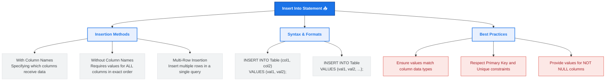

# Lesson 52 - SQL Insert Into Statement

## 📘 Introduction

In this lesson, we learned about:

📥 **The INSERT INTO Statement**

How to insert new records into a database table. We explored different methods of inserting data, including inserting single rows (with or without column specifications) and inserting multiple rows in a single query.

---

# 🧠 What is the SQL INSERT INTO Statement?

The `INSERT INTO` statement is a Data Manipulation Language (DML) command used to add new rows of data to an existing table in a database.

There are two primary ways to write this statement:
1. **Specifying Column Names:** Clearly defining which columns will receive the values. Highly recommended for clarity and maintaining compatibility if the table structure changes later.
2. **Without Column Names:** Omitting the column names and providing values for all columns in the exact order they are defined in the database schema.

---

# 🗺️ INSERT INTO Statement Mind Map

Below is a visual overview of SQL `INSERT INTO` concepts, methods, and best practices:



---

# 🖥️ SQL INSERT INTO Syntax (SQL Server)

To insert data into a table in Microsoft SQL Server, you use the following syntaxes:

### 1. Inserting with Column Names (Recommended)
This approach is safe because it doesn't break if you add new columns to the table in the future.
```sql
INSERT INTO table_name (column1, column2, column3, ...)
VALUES (value1, value2, value3, ...);
```

### 2. Inserting without Column Names
If you are inserting values for all columns of the table, you can skip the column list, but the values must align perfectly with the table's column sequence.
```sql
INSERT INTO table_name
VALUES (value1, value2, value3, ...);
```

### 3. Inserting Multiple Rows
You can insert multiple rows at once by separating the value sets with commas.
```sql
INSERT INTO table_name (column1, column2)
VALUES 
    (value1_a, value2_a),
    (value1_b, value2_b),
    (value1_c, value2_c);
```

---

# 💡 Complete Example

Refer to [SQLQuery4.sql](file:///i:/Programming/AboHuhaed/06 - Introduction to Programming Using C++ Level 2/15 - Database Level 1 - SQL/LESSON-52   Insert Into Statement/SQLQuery4.sql) for the SQL query applied in this lesson.

### 1. Creating the Table:
```sql
CREATE TABLE Employees (
    EmployeeID INT PRIMARY KEY,
    FirstName VARCHAR(50),
    LastName VARCHAR(50),
    Email VARCHAR(100),
    HireDate DATE,
    Salary DECIMAL(10, 2)
);
```

### 2. Inserting Multiple Rows (Without column names):
```sql
INSERT INTO Employees 
VALUES 
    (2, 'Sara',  'Ali',     'added@gmail.com', '2019-03-10', 60000.00),
    (3, 'John',  'Doe',     'adfakl2@gmil.com', '2021-07-20', 55000.00);
```

### 3. Inserting a Single Row:
```sql
INSERT INTO Employees
VALUES 
    (6, 'Emily', 'Smith', 'adf@gmail.com', '2022-05-01', 62000.00);
```

> [!NOTE]
> When executing `INSERT INTO` without column names, if you miss a single value or mismatch the column order, SQL Server will return an error (e.g., column count mismatch or data type conversion error).

---

# ⚠️ Important Considerations & Best Practices

1. 🔒 **Respect Primary Keys & Unique Constraints:** Attempting to insert a duplicate value into a column defined with a `PRIMARY KEY` or `UNIQUE` constraint will throw a violation error and fail the insert operation.
   > [!TIP]
   > Always verify existing records or let SQL Server generate identifiers automatically using the `IDENTITY(1,1)` property for auto-incrementing primary keys.

2. 🚫 **NOT NULL Constraints:** Any column marked as `NOT NULL` must receive a value during insertion unless it has a default value defined.
   
3. 📝 **Data Type Matching:** String values (`VARCHAR`, `CHAR`, etc.) and date values must be enclosed in single quotes `'value'`, while numerical values should not.

---

# 👨‍💻 Author

Ahmed Darwish 🚀
