# Lesson 49 - SQL Backup Database

## 📘 Introduction

In this lesson, we learned about:

💾 Backing Up a SQL Database

How to create copies of database files to prevent data loss. A backup is a copy of data from a SQL database that can be used to reconstruct the data in the event of hardware failure, system crashes, or data corruption.

---

# 🧠 What is SQL Database Backup?

A database backup is a complete or partial replica of your database's structure and data, saved to an external storage medium (such as a local disk, network share, or cloud storage). 

In production environments, backups form the backbone of any Disaster Recovery (DR) plan. They ensure business continuity in case of:
* 💥 Hardware/Storage failure
* 🧑‍💻 Accidental data deletion or modification (User error)
* 🐛 Software corruption
* 🔒 Ransomware/Cyberattacks

---

# 🗺️ Backup Strategy Mind Map

Below is a visual overview of SQL Database Backup types, options, and best practices:

```mermaid
graph TD
    %% Styling
    classDef main fill:#1a73e8,stroke:#0d47a1,stroke-width:2px,color:#fff,font-weight:bold;
    classDef category fill:#e8f0fe,stroke:#1a73e8,stroke-width:2px,color:#1a73e8,font-weight:bold;
    classDef detail fill:#f1f3f4,stroke:#dadce0,stroke-width:1px,color:#3c4043;
    classDef warning fill:#fce8e6,stroke:#d93025,stroke-width:1px,color:#a51d24;

    Root[SQL Database Backup 💾]:::main

    %% Branches
    Root --> Types[Backup Types]:::category
    Root --> Syntax[Syntax & Commands]:::category
    Root --> BestPractices[Best Practices]:::category
    Root --> Constraints[Important Rules & Constraints]:::category

    %% Types Details
    Types --> Full[Full Backup<br/>Copies entire database]:::detail
    Types --> Diff[Differential Backup<br/>Changes since last Full]:::detail
    Types --> Log[Transaction Log Backup<br/>All transaction logs for point-in-time recovery]:::detail

    %% Syntax Details
    Syntax --> CmdBackup["BACKUP DATABASE DB_Name<br/>TO DISK = 'path.bak'"]:::detail
    Syntax --> CmdOptions[WITH Options<br/>COMPRESSION, FORMAT, STATS]:::detail

    %% Best Practices Details
    BestPractices --> Auto[Automate using SQL Server Agent]:::detail
    BestPractices --> Test[Test restores regularly]:::detail
    BestPractices --> Offsite[Store backups offsite]:::detail

    %% Constraints Details
    Constraints --> Perms[sysadmin / db_owner roles required]:::warning
    Constraints --> Space[Sufficient disk space is critical]:::warning
    Constraints --> Permissions[SQL Service account must have write permissions to path]:::warning
```



---

# 🖥️ SQL Backup Database Syntax (SQL Server)

To back up a database in Microsoft SQL Server, you use the `BACKUP DATABASE` statement.

### 1. Full Backup (Default)
This creates a complete copy of the database.
```sql
BACKUP DATABASE database_name
TO DISK = 'filepath.bak';
```

### 2. Backup with Compression and Progress Report
Use options like `COMPRESSION` to reduce backup file size and `STATS` to monitor progress.
```sql
BACKUP DATABASE database_name
TO DISK = 'filepath.bak'
WITH FORMAT,
COMPRESSION,
STATS = 10;
```

---

# 💡 Complete Example

Refer to [SQLQuery1.sql](file:///i:/Programming/AboHuhaed/06 - Introduction to Programming Using C++ Level 2/15 - Database Level 1 - SQL/Lesson-49   Backup Database/SQLQuery1.sql) for the SQL query applied in this lesson.

### Backing up database `DB1` to disk:
```sql
BACKUP DATABASE DB1
TO DISK = 'C:\DB1.bak';
```

> [!NOTE]
> Make sure that the SQL Server instance has write permissions to the path where you want to write the backup file (in this case, `C:\`).

---

# ⚠️ Important Considerations & Best Practices

Before performing database backups, keep these critical points in mind:

1. 🔑 **Permission Requirements:** You must belong to the **sysadmin** fixed server role, or the **db_owner** or **db_backupoperator** fixed database roles to run database backups.
2. 📂 **SQL Server Service Permissions:** The backup file is written by the SQL Server engine, not by your current user account. The Windows account running the SQL Server service must have write permissions to the target folder.
3. 💾 **Disk Space:** Check the size of the database and ensure the target disk has enough space. Running out of space mid-backup will cause the backup to fail.
4. ⚙️ **The 3-2-1 Backup Rule:**
   * Keep **3** total copies of your data.
   * Store them on **2** different types of media (e.g., Disk and Cloud).
   * Keep **1** backup copy offsite or in the cloud.
5. 🧪 **Verify and Test Restores:** A backup is only as good as its restore. Schedule routine restore tasks in a testing environment to verify that your backup files are not corrupted.

---

# 👨‍💻 Author

Ahmed Darwish 🚀
