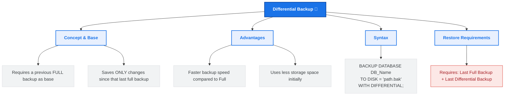

# Lesson 50 - SQL Differential Backup

## 📘 Introduction

In this lesson, we learned about:

💾 **Differential Database Backup**

How to optimize backup time and storage by only backing up the data that has changed since the last full database backup.

---

# 🧠 What is a Differential Backup?

A **Differential Backup** is a type of backup that only copies the data that has changed since the last **Full Backup** (which acts as the *differential base*).

As time passes and more changes are made to the database, the size of subsequent differential backups will grow until a new Full Backup is performed to reset the base.

### 📊 Full vs. Differential Backup
| Feature | Full Backup | Differential Backup |
| :--- | :--- | :--- |
| **Data Saved** | The entire database (structure & data) | Only changes since the last Full Backup |
| **Backup Time** | Slower (depends on DB size) | Very fast |
| **Storage Size** | Large | Small (grows over time) |
| **Restore Speed** | Fast (single file restore) | Requires restoring the Full Backup + the latest Differential |

---

# 🗺️ Differential Backup Mind Map

Below is a visual overview of SQL Differential Backup concepts:



---

# 🖥️ SQL Differential Backup Syntax (SQL Server)

To perform a differential backup in Microsoft SQL Server, you use the `BACKUP DATABASE` statement with the `WITH DIFFERENTIAL` option.

```sql
BACKUP DATABASE database_name
TO DISK = 'filepath.bak'
WITH DIFFERENTIAL;
```

---

# 💡 Complete Example

Refer to [SQLQuery1.sql](file:///i:/Programming/AboHuhaed/06 - Introduction to Programming Using C++ Level 2/15 - Database Level 1 - SQL/Lesson-50   Differential Backup/SQLQuery1.sql) for the SQL query applied in this lesson.

### Backing up database `DB1` differentially to disk:
```sql
BACKUP DATABASE DB1
TO DISK = 'C:\DB1.bak'
WITH DIFFERENTIAL;
```

> [!IMPORTANT]
> A differential backup **cannot** be created without a previous **Full Backup** of the same database existing on the system. If you attempt it on a database that has never had a Full Backup, SQL Server will throw an error.

---

# ⚠️ Important Considerations & Best Practices

1. 🔄 **Incremental Nature:** A differential backup is *cumulative*. If you take a full backup on Sunday, a differential on Monday will contain Monday's changes. A differential on Tuesday will contain *both* Monday and Tuesday's changes.
2. 🛠️ **Recovery Plan:** When disaster strikes, to restore a database to its latest state using differential backups, you only need to restore:
   1. The last **Full Backup** (with `NORECOVERY`).
   2. The most recent **Differential Backup** (with `RECOVERY`).
   *(Any intermediate differential backups do not need to be restored).*
3. 💾 **Storage Optimization:** Regularly scheduling Full Backups (e.g., weekly) and Differential Backups (e.g., daily) balances backup window times and storage conservation.

---

# 👨‍💻 Author

Ahmed Darwish 🚀
