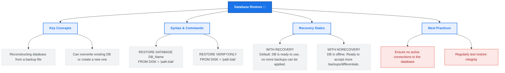

# Lesson 51 - SQL Restore Database

## 📘 Introduction

In this lesson, we learned about:

🔄 **Restoring a SQL Database**

How to reconstruct a database from a previously created backup file (`.bak`) to recover from data loss, corruption, or to duplicate a database.

---

# 🧠 What is SQL Database Restore?

Database restoration is the process of copying data, log pages, and schema details from a database backup and applying any transaction log records to roll the database forward to a consistent state.

Restoring is the actual test of a backup strategy. Without a working restore process, backups are useless.

---

# 🗺️ Database Restore Mind Map

Below is a visual overview of SQL Database Restore concepts, syntax, and states:



---

# 🖥️ SQL Restore Database Syntax (SQL Server)

To restore a database in Microsoft SQL Server, you use the `RESTORE DATABASE` statement.

### 1. Basic Restore (Default)
Restores the database from a backup file and makes it online (using default `WITH RECOVERY`).
```sql
RESTORE DATABASE database_name
FROM DISK = 'filepath.bak';
```

### 2. Restore with NORECOVERY (For multi-step restores)
Used when you have additional files to restore (like differential backups or transaction logs). The database remains in a **Restoring** state.
```sql
RESTORE DATABASE database_name
FROM DISK = 'full_backup.bak'
WITH NORECOVERY;
```

---

# 💡 Complete Example

Refer to [SQLQuery3.sql](file:///i:/Programming/AboHuhaed/06 - Introduction to Programming Using C++ Level 2/15 - Database Level 1 - SQL/Lesson-51  Restore Database/SQLQuery3.sql) for the SQL query applied in this lesson.

### Restoring database `DB1` from backup file on disk:
```sql
RESTORE DATABASE DB1
FROM DISK = 'C:\DB1.bak';
```

> [!NOTE]
> Ensure the target database isn't actively being used or locked by other connections when you run this command.

---

# ⚠️ Important Considerations & Best Practices

1. 🚫 **Exclusive Access Required:** SQL Server requires exclusive access to the database during a restore. If there are active connections, the restore command will hang or fail.
   > [!TIP]
   > You can force close connections by setting the database to single-user mode:
   > ```sql
   > ALTER DATABASE DB1 SET SINGLE_USER WITH ROLLBACK IMMEDIATE;
   > -- Run RESTORE command here
   > ALTER DATABASE DB1 SET MULTI_USER;
   > ```
2. 🔍 **Verify Backup Integrity First:** You can verify that a backup file is valid and readable without actually restoring it using:
   ```sql
   RESTORE VERIFYONLY FROM DISK = 'C:\DB1.bak';
   ```
3. 💾 **File Relocation (WITH MOVE):** If you are restoring a database to a different server or folder where the original paths do not exist, you must use the `WITH MOVE` option to specify new locations for the `.mdf` (data) and `.ldf` (log) files.

---

# 👨‍💻 Author

Ahmed Darwish 🚀
