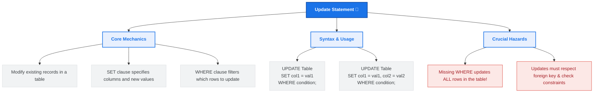

# Lesson 53 - SQL Update Statement

## 📘 Introduction

In this lesson, we learned about:

🔄 **The UPDATE Statement**

How to modify existing records in a database table. We explored how to update a single column, how to update multiple columns simultaneously, and the critical importance of utilizing the `WHERE` clause to target specific records.

---

# 🧠 What is the SQL UPDATE Statement?

The `UPDATE` statement is a Data Manipulation Language (DML) command used to edit or change existing data in a table. 

Unlike the `INSERT INTO` statement (which adds completely new rows) or the `DELETE` statement (which removes rows), the `UPDATE` statement modifies existing fields within specified records.

---

# 🗺️ UPDATE Statement Mind Map

Below is a visual overview of SQL `UPDATE` concepts, syntax patterns, and safety practices:



---

# 🖥️ SQL UPDATE Syntax (SQL Server)

To update records in a table, you use the `UPDATE` statement combined with the `SET` and `WHERE` clauses:

### 1. Updating a Single Column for Specific Rows
Changes the value in a single column for all rows matching the criteria.
```sql
UPDATE table_name
SET column1 = new_value1
WHERE condition;
```

### 2. Updating Multiple Columns for a Specific Row
Updates multiple fields at once by separating assignments with a comma.
```sql
UPDATE table_name
SET column1 = new_value1, 
    column2 = new_value2,
    column3 = new_value3
WHERE condition;
```

---

# 💡 Complete Example

Refer to [SQLQuery6.sql](file:///i:/Programming/AboHuhaed/06 - Introduction to Programming Using C++ Level 2/15 - Database Level 1 - SQL/Lesson-53 Update statement/SQLQuery6.sql) for the SQL query applied in this lesson.

### 1. Updating a Single Column (Setting salary to 500 for employees with salary less than 50,000):
```sql
UPDATE Employees
SET Salary = 500
WHERE Salary < 50000;
```

### 2. Updating Multiple Columns for a Single Employee (Updating Name and Salary for Employee ID 2):
```sql
UPDATE Employees
SET FirstName = 'Ahmed',
    LastName = 'Ali',
    Salary = 60000
WHERE EmployeeID = 2;
```

---

# ⚠️ Important Considerations & Best Practices

1. 🚨 **The Danger of Missing the WHERE Clause:** If you omit the `WHERE` clause in an `UPDATE` statement, **every single record** in the table will be updated with the new values! This is one of the most common and critical mistakes in database administration.
   > [!WARNING]
   > Always double-check your `WHERE` clauses before executing an `UPDATE` statement.
   > ```sql
   > -- DANGER: This will make everyone's salary 1,000,000!
   > UPDATE Employees
   > SET Salary = 1000000; 
   > ```

2. 🔍 **Verify before Updating:** A great practice is to write a `SELECT` statement with the exact same `WHERE` clause first. Once you verify that the selected records are correct, change the statement to an `UPDATE`.
   > [!TIP]
   > ```sql
   > -- Step 1: Verify the rows
   > SELECT * FROM Employees WHERE EmployeeID = 2;
   > 
   > -- Step 2: Safe Update
   > UPDATE Employees SET Salary = 60000 WHERE EmployeeID = 2;
   > ```

3. 🛡️ **Transaction Protection:** For dangerous updates, wrap them in a transaction so you can roll them back if anything goes wrong:
   ```sql
   BEGIN TRANSACTION;
   
   UPDATE Employees
   SET Salary = 55000
   WHERE Department = 'IT';
   
   -- If it looks correct:
   COMMIT;
   -- If there's an error:
   ROLLBACK;
   ```

---

# 👨‍💻 Author

Ahmed Darwish 🚀
