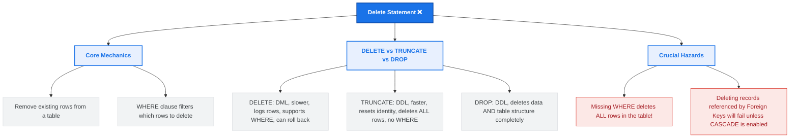

# Lesson 54 - SQL Delete Statement

## 📘 Introduction

In this lesson, we learned about:

❌ **The DELETE Statement**

How to remove existing records from a database table. We explored how to delete specific rows using the `WHERE` clause, the critical importance of filtering, and the key differences between `DELETE`, `TRUNCATE`, and `DROP` commands.

---

# 🧠 What is the SQL DELETE Statement?

The `DELETE` statement is a Data Manipulation Language (DML) command used to remove one or more existing records from a table. 

Unlike the `DROP` statement (which deletes the entire table structure) or the `UPDATE` statement (which modifies existing values), the `DELETE` statement removes entire rows while keeping the table structure, columns, and constraints intact.

---

# 🗺️ DELETE Statement Mind Map

Below is a visual overview of SQL `DELETE` concepts, syntax patterns, and safety practices:



---

# 🖥️ SQL DELETE Syntax (SQL Server)

To delete records from a table, you use the `DELETE FROM` statement combined with the `WHERE` clause:

### 1. Deleting Specific Rows
Removes only the rows that match the condition in the `WHERE` clause.
```sql
DELETE FROM table_name
WHERE condition;
```

### 2. Deleting All Rows (Keep Structure)
Removes all records from the table but keeps the structure, columns, and indexes.
```sql
DELETE FROM table_name;
```

---

# 💡 Complete Example

Refer to [SQLQuery7.sql](file:///i:/Programming/AboHuhaed/06 - Introduction to Programming Using C++ Level 2/15 - Database Level 1 - SQL/Lesson-54 Delete Statement/SQLQuery7.sql) for the SQL query applied in this lesson.

### Deleting a Specific Record (e.g., Employee ID 9):
```sql
DELETE FROM Employees
WHERE EmployeeID = 9;

SELECT * FROM Employees;
```

---

# ⚔️ Comparison: DELETE vs. TRUNCATE vs. DROP

| Feature | DELETE | TRUNCATE | DROP |
| :--- | :--- | :--- | :--- |
| **Command Type** | DML (Data Manipulation Language) | DDL (Data Definition Language) | DDL (Data Definition Language) |
| **WHERE Clause** | Supported (can delete specific rows) | Not supported (deletes all rows) | Not supported (deletes whole table) |
| **Speed** | Slower (deletes row-by-row and logs each deletion) | Faster (deallocates pages, logs minimal data) | Fastest (removes the table completely) |
| **Identity Reset** | Does **NOT** reset the identity seed | Resets the identity seed | Table structure is deleted entirely |
| **Rollback** | Can be rolled back inside a transaction | Can be rolled back (in SQL Server) | Can be rolled back (in SQL Server) |
| **Triggers** | Fires DELETE triggers | Does not fire triggers | Does not fire triggers |

---

# ⚠️ Important Considerations & Best Practices

1. 🚨 **The Danger of Missing the WHERE Clause:** If you omit the `WHERE` clause in a `DELETE` statement, **every single record** in the table will be deleted!
   > [!WARNING]
   > Always double-check your `WHERE` clauses before executing a `DELETE` statement.
   > ```sql
   > -- DANGER: This will delete ALL employees!
   > DELETE FROM Employees;
   > ```

2. 🔍 **Verify before Deleting:** Always run a `SELECT` query with the exact same `WHERE` condition to confirm which records will be affected before executing the `DELETE` command.
   > [!TIP]
   > ```sql
   > -- Step 1: Verify the rows to be deleted
   > SELECT * FROM Employees WHERE Salary < 3000 AND Department = 'Marketing';
   > 
   > -- Step 2: Safe Delete
   > DELETE FROM Employees WHERE Salary < 3000 AND Department = 'Marketing';
   > ```

3. 🛡️ **Transaction Protection:** Wrap your delete commands in a transaction to verify the number of affected rows before committing:
   ```sql
   BEGIN TRANSACTION;
   
   DELETE FROM Employees
   WHERE Active = 0;
   
   -- If the number of affected rows matches your expectation:
   COMMIT;
   -- If too many or incorrect rows were affected:
   ROLLBACK;
   ```

---

# 👨‍💻 Author

Ahmed Darwish 🚀
