# Lesson 56 - SQL Insert Into Select Statement

## 📘 Introduction

In this lesson, we learned about:

📥 **The INSERT INTO SELECT Statement**

This statement is used to copy data from one table and insert it into another existing table. It acts as a bridge to transfer records efficiently between tables without needing external scripts or intermediate data files.

---

# 🧠 What is the SQL INSERT INTO SELECT Statement?

The `INSERT INTO SELECT` statement is a powerful command that combines the query capabilities of `SELECT` with the insertion capabilities of `INSERT INTO`. 

### Key Characteristics:
* **Existing Target Table:** The target table must already exist in the database.
* **Data Type Matching:** The data types in the target table must match or be compatible with the source columns returned by the `SELECT` query.
* **Filtering & Criteria:** You can filter the records being copied using a `WHERE` clause in the `SELECT` statement.

---

# 🗺️ INSERT INTO SELECT Mind Map

Below is a visual overview of how the SQL `INSERT INTO SELECT` statement works and its common use cases:

```mermaid
graph TD
    %% Styling
    classDef main fill:#1a73e8,stroke:#0d47a1,stroke-width:2px,color:#fff,font-weight:bold;
    classDef category fill:#e8f0fe,stroke:#1a73e8,stroke-width:2px,color:#1a73e8,font-weight:bold;
    classDef detail fill:#f1f3f4,stroke:#dadce0,stroke-width:1px,color:#3c4043;
    classDef warning fill:#fce8e6,stroke:#d93025,stroke-width:1px,color:#a51d24;

    Root[Insert Into Select 📥]:::main

    Root --> Mechanics[How It Works]:::category
    Root --> UseCases[Common Use Cases]:::category
    Root --> Practices[Best Practices]:::category

    Mechanics --> ReadSource[1. Read from Source Table<br/>via SELECT query]:::detail
    Mechanics --> WriteTarget[2. Write into Target Table<br/>via INSERT INTO]:::detail
    Mechanics --> SchemaMatch[3. Target table must already exist]:::detail

    UseCases --> Archiving[Archiving old/inactive data]:::detail
    UseCases --> DataMigration[Migrating data between tables]:::detail
    UseCases --> BackupSubsets[Backing up subsets of data]:::detail

    Practices --> ColMatch[Ensure column order and data types match]:::warning
    Practices --> ConstraintCheck[Respect primary keys & unique constraints]:::warning
    Practices --> FilterData[Use WHERE clause to filter transferred rows]:::warning
```



---

# 🖥️ SQL INSERT INTO SELECT Syntax (SQL Server)

To insert data into a table from another table, you can use the following syntaxes:

### 1. Copying All Columns (Assuming schemas match perfectly)
```sql
INSERT INTO target_table
SELECT * FROM source_table
WHERE condition;
```

### 2. Copying Specific Columns (Recommended for Safety)
This ensures that changes in the target or source table schema won't break the query as long as the specified columns exist.
```sql
INSERT INTO target_table (column1, column2, column3)
SELECT column1, column2, column3
FROM source_table
WHERE condition;
```

---

# 💡 Complete Example

Refer to [SQLQuery2.sql](file:///i:/Programming/AboHuhaed/06 - Introduction to Programming Using C++ Level 2/15 - Database Level 1 - SQL/Lesson-56 Insert into statement/SQLQuery2.sql) for the SQL query applied in this lesson.

### 1. Creating the Tables:
```sql
-- Create the source table (oldperson)
create table oldperson (
	id int primary key,
	name varchar(255) not null,
	age int not null
);

-- Create the target table (Person)
create table Person (
	id int primary key,
	name varchar(255) not null,
	age int not null
);
```

### 2. Seeding the Source Table:
```sql
insert into oldperson (id, name, age) values 
(1, 'John Doe', 75),
(2, 'Jane Smith', 80),
(3, 'Bob Johnson', 85);
```

### 3. Copying Data using INSERT INTO SELECT:
```sql
insert into Person
Select * from oldperson;
```

### 4. Verifying the Insertion:
```sql
select * from Person;
```

> [!NOTE]
> Unlike `SELECT INTO` (which creates a new table automatically), `INSERT INTO SELECT` requires the target table (`Person` in this case) to be created beforehand.

---

# ⚠️ Important Considerations & Best Practices

1. 🔒 **Constraints & Duplicates:** Make sure you don't violate `PRIMARY KEY` or `UNIQUE` constraints in the target table when copying records. If any duplicate keys are inserted, the entire transaction will fail.
   
2. 🚫 **NOT NULL Columns:** If the target table has columns defined as `NOT NULL` and the source query returns `NULL` (or doesn't map to them), the query will fail unless those columns have defined default values.

3. 📂 **Subset Copying:** Always use the `WHERE` clause if you only want to archive or copy a subset of data (e.g., active users, older logs, etc.).

---

# 👨‍💻 Author

Ahmed Darwish 🚀
